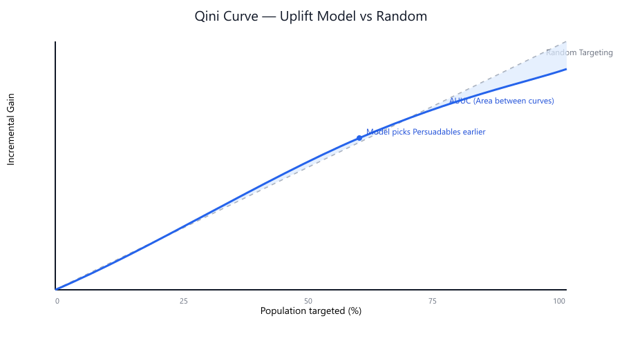
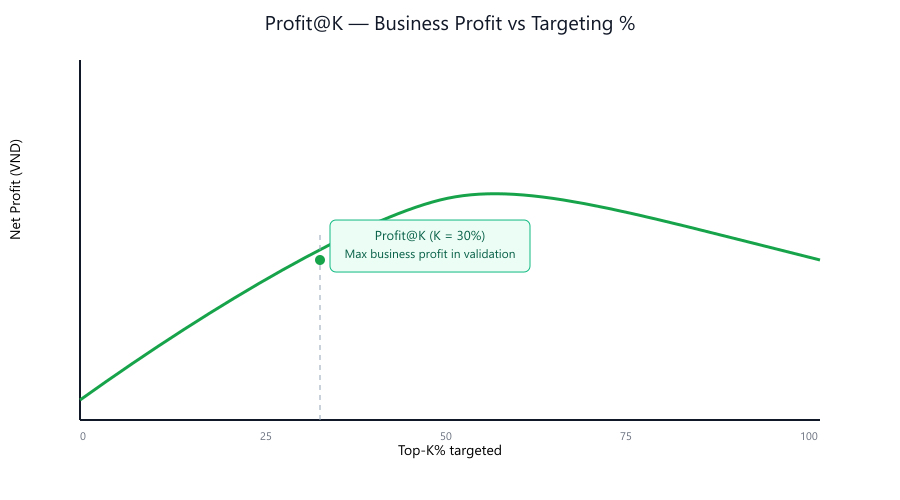
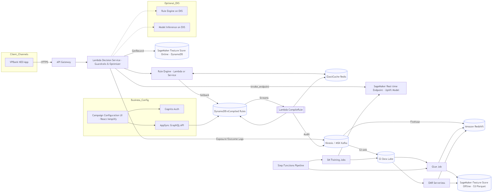

# **Uplift Engine: A Modernized Data Platform for Prescriptive Promotion Campaigns**
### **Technical Whitepaper & Implementation Guide**
**Version: 2.1**
**Team: Uplift Engine**

---

## **Mục Lục**

1.  **Tóm Tắt Quản Trị (Executive Summary)**
    * 1.1. Vấn đề cốt lõi: Sự lãng phí trong marketing truyền thống.
    * 1.2. Giải pháp: Chuyển dịch từ AI Dự đoán sang AI Chỉ định.
    * 1.3. Tác động kinh doanh: Con số ROI và tiết kiệm chi phí.

2.  **Chương 1: Bối Cảnh & Thách Thức Kinh Doanh**
    * 1.1. Phân Tích "Nỗi Đau": Mô hình 4 Nhóm Khách Hàng.
    * 1.2. Tại Sao Các Mô Hình Propensity Truyền Thống Thất Bại?
    * 1.3. Mục Tiêu Chiến Lược: Tối Đa Hóa Lợi Nhuận Thuần Gia Tăng (Net Profit Uplift).

3.  **Chương 2: Lõi Trí Tuệ - Nền Tảng Causal AI**
    * 2.1. Giới thiệu về Causal Inference và Uplift Modeling.
    * 2.2. Lựa chọn Thuật Toán: "Cuộc Đua" Của Các Meta-Learners.
    * 2.3. Thước Đo Thành Công: Từ Qini Curve đến Profit@K (VND).
    * 2.4. Triển khai Huấn luyện trên SageMaker.

4.  **Chương 3: Kiến Trúc Hệ Thống "Uplift Engine 2.1" trên AWS**
    * 3.1. Triết Lý Thiết Kế: MLOps-driven, Serverless-first, Low-latency.
    * 3.2. Sơ Đồ Kiến Trúc Tổng Thể.
    * 3.3. Phân Tích Sâu Các Thành Phần Dịch Vụ AWS.
    * 3.4. Business User Configurability: Campaign Configuration UI & Rule Engine.
    * 3.5. Rule Engine Architecture (DSL, Storage, Evaluation).

5.  **Chương 4: Luồng Kỹ Thuật Chi Tiết - Từ Dữ Liệu Đến Quyết Định**
    * 4.1. Luồng MLOps: Tự Động Hóa Vòng Đời Mô Hình với Step Functions.
        * 4.1.1. Data Cleaning, Enrichment & Transformation (Glue/EMR + Spark).
    * 4.2. Luồng Real-time: Phản Hồi Dưới 100ms.
        * 4.2.1. Giám Sát & Cảnh Báo (Monitoring & Alerting).
        * 4.2.2. Hiệu năng & Benchmarks (Performance & Capacity Plan).
    * 4.3. Luồng Cấu hình & Đánh giá Rule (Batch/Streaming/Realtime).

6.  **Chương 5: Hiện Thực Hóa Các Module Nâng Cao**
    * 5.1. Bộ Tối Ưu Hóa Ngân Sách (Knapsack Optimizer).
    * 5.2. Bộ Lọc An Toàn "Do-No-Harm" (Guardrails).
    * 5.3. Module Học Online (Contextual Bandits).
    * 5.4. Explainability là Tính năng Lõi (SHAP/LIME trong Inference).

7.  **Chương 6: Lộ Trình Triển Khai & Tầm Nhìn Tương Lai**
    * 6.1. Lộ Trình Triển Khai theo Từng Giai Đoạn.
    * 6.2. Mở Rộng Ngoài Khuyến Mãi: Next Best Action, Dynamic Pricing.
    * 6.3. Tầm Nhìn Về Quản Trị Rủi Ro & Explainable AI (XAI).
    * 6.4. Agile Delivery & Ways of Working.
    * 6.5. Demo Scenarios: Cashback (Batch) & Sales Contest (Real-time).
    
Phụ lục
    * Phụ lục A: Metric chuẩn & IaC mẫu (Monitoring & Alerting)
    * Phụ lục B: Ma trận Loại Khuyến Mãi vs Ràng Buộc
    * Phụ lục C: Đối chiếu yêu cầu & giả định (Traceability & Assumptions)

---

> Ghi chú thuật ngữ (dùng nhất quán trong tài liệu):
> - Causal AI: AI Nhân quả (giữ nguyên tiếng Anh khi nhắc đến lĩnh vực/chuyên ngành).
> - Uplift Score: Điểm ước tính hiệu ứng can thiệp cá nhân (ITE).
> - Net Profit Uplift: Lợi nhuận thuần gia tăng = Incremental Revenue − Cost of Treatment.
> - Profit@K: Lợi nhuận (VND) khi target Top-K% theo Uplift Score.
> - Tên biến trong code: dùng snake_case, ví dụ `uplift_score`, `uplift_std_error`.
> - Treatment (Tác nhân): Bất kỳ can thiệp marketing áp dụng lên khách hàng, không chỉ khuyến mãi; bao gồm email, SMS, push/in-app notification, banner/offer trong app/web, cuộc gọi telesales/call center, v.v.
> - Rule (Quy tắc): Biểu thức điều kiện nghiệp vụ dùng để xác định eligibility (đủ điều kiện) cho một ưu đãi/chương trình.
> - Rule Set (Tập quy tắc): Tập các Rule có ưu tiên/độ phủ khác nhau, có hiệu lực trong một giai đoạn (effective window).
> - Eligibility (Đủ điều kiện): Kết quả đánh giá Rule cho biết khách hàng có đạt điều kiện hưởng ưu đãi/chương trình hay không.
> - Tier (Hạng/Ngưỡng): Cấp độ thưởng/ưu đãi theo mức chi tiêu hoặc KPI (ví dụ: Silver/Gold/Platinum).
> - Explanation (Giải thích): Câu giải thích thân thiện (human-readable) được sinh tự động mô tả vì sao khách hàng đủ điều kiện (ví dụ: "Chi tiêu 5M VND nhóm Dining trong tuần này, đạt hạng Gold").
> - SHAP (SHapley Additive exPlanations): Kỹ thuật phân rã đóng góp của từng feature vào dự đoán; hỗ trợ tính nhanh (TreeSHAP) với mô hình cây.
> - Reason Codes: Danh sách ngắn (top-K) các yếu tố chính ảnh hưởng đến quyết định, kèm dấu (+/-) và cường độ xấp xỉ.

### **Tóm Tắt Quản Trị (Executive Summary)**

Hãy tưởng tượng cùng một ngân sách 5 tỷ đồng cho khuyến mãi, nhưng thay vì “rải” và hy vọng, mỗi đồng đều được đặt đúng chỗ — vào những khách hàng thực sự có thể được thuyết phục. Đó là điều Uplift Engine mang lại: biến marketing từ chi phí thành động cơ tăng trưởng bằng Causal AI. Không chỉ thông minh hơn, nền tảng còn “trao quyền” cho nghiệp vụ: business users có thể tự thiết kế và vận hành chiến dịch mà không phụ thuộc vào developer, trong khi hệ thống vẫn đảm bảo kiểm soát và an toàn.

Các nền tảng dữ liệu khuyến mãi truyền thống thường:
- Tập trung vào báo cáo quá khứ và dự đoán tương lai, nhưng ít trả lời câu hỏi: hành động nào mang lại lợi nhuận cao nhất?
- Dẫn đến lãng phí ngân sách tới 70% ở các nhóm không tạo giá trị gia tăng.

"Uplift Engine" mang lại thay đổi quan trọng:
- Không chỉ là Data Platform mà là một Decisioning Engine kết hợp Rule Engine cấu hình được với Causal AI.
- Áp dụng Causal AI để chuyển từ dự đoán “Ai sẽ mua?” sang chỉ định “Nên tác động vào ai để tối đa hóa lợi nhuận?”, đồng thời luôn kèm theo giải thích rõ ràng (explainability) cho từng quyết định.

Kiến trúc và tác động:
- Serverless-first, realtime < 100ms; SageMaker Feature Store làm trung tâm để loại bỏ training-serving skew.
- Tích hợp đầy đủ các thành phần hiện đại: Redis để cache và giảm độ trễ, Kafka/MSK hoặc Kinesis cho streaming, Redshift cho data warehousing và báo cáo chuyên sâu.
- Kết quả mô phỏng: tăng 308% ROI và tiết kiệm 70% ngân sách so với cách truyền thống, trong khi minh bạch hóa lý do đủ điều kiện/ra quyết định cho từng khách hàng.

---
### **Chương 1: Bối Cảnh & Thách Thức Kinh Doanh**

#### **1.1. Phân Tích "Nỗi Đau": Mô hình 4 Nhóm Khách Hàng**

Gốc rễ của vấn đề lãng phí trong các chiến dịch marketing dựa trên dự đoán (predictive marketing) nằm ở việc các mô hình này đối xử với mọi khách hàng có vẻ tiềm năng như nhau. Lý thuyết Causal Inference (Suy luận Nhân quả) cung cấp một lăng kính rõ ràng hơn, phân loại khách hàng thành 4 nhóm riêng biệt khi đối mặt với một tác nhân (treatment) — tức là bất kỳ can thiệp marketing nào: khuyến mãi/ưu đãi, email, SMS, push/in-app notification, banner/offer trong app/web, cuộc gọi telesales/call center, v.v.:

• Lưu ý thuật ngữ: trong tài liệu này, “tác nhân” (treatment) được hiểu là mọi hình thức can thiệp marketing áp dụng lên khách hàng, không chỉ riêng khuyến mãi.

Để dễ theo dõi, phần dưới sắp xếp theo logic câu chuyện: bắt đầu từ nhóm “ai cũng nghĩ đến” (Sure Things), rồi đến nhóm tạo giá trị thật (Persuadables), và cuối cùng là hai nhóm gây lãng phí/thiệt hại (Lost Causes, Sleeping Dogs).

* **Sure Things (Người chắc chắn mua):** Nhóm khách hàng này sẽ chuyển đổi dù có hay không có khuyến mãi. Việc gửi khuyến mãi cho họ không tạo ra thêm doanh thu, mà chỉ làm **tăng chi phí không cần thiết**, trực tiếp làm xói mòn lợi nhuận của chiến dịch. Đây là hố đen lãng phí ngân sách lớn nhất.

* **Persuadables (Người có thể thuyết phục):** Đây là nhóm khách hàng chỉ thực hiện hành vi chuyển đổi (ví dụ: mở thẻ tín dụng) **khi và chỉ khi** họ nhận được khuyến mãi. Đây là mỏ vàng, là nguồn tạo ra **lợi nhuận gia tăng (incremental profit)** duy nhất cho chiến dịch.

* **Lost Causes (Người không thể lay chuyển):** Nhóm này sẽ không chuyển đổi trong mọi trường hợp, dù có nhận được khuyến mãi hay không. Mọi nỗ lực marketing nhắm vào họ đều là chi phí vô ích.

* **Sleeping Dogs (Người tiêu cực):** Đây là nhóm nguy hiểm nhất. Việc gửi khuyến mãi không những không mang lại chuyển đổi, mà còn có thể gây ra phản ứng tiêu cực (cảm thấy bị làm phiền, đánh dấu spam, hoặc thậm chí là rời bỏ dịch vụ - churn). Nhóm này gây hại trực tiếp cho thương hiệu và mối quan hệ khách hàng.

##### Ví dụ:

Giả sử có 100 khách hàng trong một chiến dịch thử nghiệm A/B.

- Phân bổ theo 4 nhóm (ước tính thực tế):
    - Sure Things: 30 khách hàng
    - Persuadables: 15 khách hàng
    - Lost Causes: 50 khách hàng
    - Sleeping Dogs: 5 khách hàng

Bảng so sánh “Có khuyến mãi” vs “Không có khuyến mãi”:

| Nhóm             | Nếu Có khuyến mãi | Nếu Không khuyến mãi | Ghi chú ảnh hưởng |
|------------------|--------------------|-----------------------|-------------------|
| Sure Things (30) | 30 chuyển đổi      | 30 chuyển đổi         | Doanh thu tự nhiên (không do chiến dịch) |
| Persuadables (15)| 15 chuyển đổi      | 0 chuyển đổi          | Giá trị gia tăng thực sự |
| Lost Causes (50) | 0 chuyển đổi       | 0 chuyển đổi          | Không giá trị, tốn chi phí nếu target |
| Sleeping Dogs (5)| Có thể giảm tương tác/complaint | 0 chuyển đổi | Có rủi ro, cần guardrails |

Tổng kết lợi ích gia tăng (incremental):
- Số chuyển đổi gia tăng thật sự đến từ Persuadables: 15.
- Chi phí lãng phí nếu target nhầm (Sure Things, Lost Causes, Sleeping Dogs) có thể chiếm phần lớn ngân sách.

Liên hệ thực chiến: Uplift Model giúp “lọc” để ưu tiên nhóm Persuadables, tránh lãng phí vào Sure Things/Lost Causes và hạn chế rủi ro Sleeping Dogs (thông qua Guardrails ở Chương 5).

#### **1.2. Tại Sao Các Mô Hình Propensity Truyền Thống Thất Bại?**

Ở phần 1.1, chúng ta thấy chi phí chỉ thực sự sinh lời ở nhóm Persuadables, trong khi Sure Things âm thầm giảm đi lợi nhuận, Lost Causes gây lãng phí, và Sleeping Dogs thậm chí gây hại. Thế nhưng phần lớn công cụ hiện có lại không “nhìn thấy” sự khác biệt này. Chúng dự đoán “Ai sẽ chuyển đổi?” thay vì “Ai sẽ thay đổi hành vi nếu có can thiệp?”.

Vấn đề cốt lõi:
- Propensity Model dự đoán `P(Conversion)` → không phân biệt được giữa Persuadables và Sure Things.
- Kết quả: nhắm mục tiêu cả những người sẽ mua dù không có khuyến mãi → lãng phí ngân sách, bào mòn lợi nhuận.

Tầng sâu: vì sao “thêm một lớp phân loại” vẫn không giải được?
- Mục tiêu đúng để ra quyết định là hiệu ứng can thiệp cá nhân: `U(X) = E[Y(1) − Y(0) | X]`. Trong khi đó mô hình propensity thường tối ưu một trong hai đại lượng khác:
    1) Huấn luyện trên mẫu có can thiệp: học `P(Y=1 | X, T=1)` (xác suất chuyển đổi khi có tác nhân), hoặc
    2) Huấn luyện trộn: học `P(Y=1 | X) = π(X) · P(Y(1)=1 | X) + (1−π(X)) · P(Y(0)=1 | X)`, với `π(X)=P(T=1|X)`.
    Cả hai đều không trực tiếp cho ta `U(X)`.
- Hai khách hàng có cùng xác suất chuyển đổi cao vẫn có uplift rất khác: A có `(Y(1)=1, Y(0)=0)` → `U(A)=1` (Persuadable); B có `(Y(1)=1, Y(0)=1)` → `U(B)=0` (Sure Thing). Một “lớp phân loại” gắn sau mô hình `P(Y=1|·)` không thể tách A và B nếu không có thông tin phản thực tế `Y(0)` của A (hoặc `Y(1)` của B).
- Đây là vấn đề nhân quả căn bản (Fundamental Problem of Causal Inference): với mỗi cá nhân, ta chỉ quan sát được một trong hai kết quả `Y(1)` hoặc `Y(0)` (không bao giờ cả hai). Để ước tính `U(X)`, ta cần thí nghiệm ngẫu nhiên (A/B) hoặc giả định mạnh (ignorability + overlap), và mô hình hóa đồng thời hai nhánh `T=1` và `T=0` (ví dụ: T-/S-/X-/DR-Learner) hoặc dùng các mô hình uplift trực tiếp.
- Thêm features hay đổi thuật toán không sửa được sai mục tiêu (target misalignment): bạn vẫn đang tối ưu hóa “khả năng chuyển đổi” thay vì “hiệu ứng của can thiệp”. Vì thế, việc “vá” bằng một tầng phân loại hậu kỳ không thể biến một mô hình tương quan thành một mô hình nhân quả.

Lưu ý thuật ngữ:
- Trong causal inference, “propensity score” là `P(T=1|X)` (xác suất được gán can thiệp). Trong thực hành marketing, “propensity model” thường ám chỉ `P(Y=1|X)` hoặc `P(Y=1|X,T=1)`. Tài liệu này dùng “propensity model” theo nghĩa marketing nêu trên, để phân biệt với “propensity score” trong nhân quả.

#### **1.2.1. Phân Rã Thất Bại Của Mô Hình Propensity: Một Ví dụ Định Lượng**

Kịch bản:
- Chiến dịch: VPBank nhắm 100,000 khách hàng có điểm propensity cao nhất để mở thẻ tín dụng.
- Chi phí: 50,000 VND/ưu đãi → tổng chi phí 5 tỷ VND.
- Kết quả bề mặt: 10,000 chuyển đổi (CR = 10%) → doanh thu 10 tỷ VND → lợi nhuận bề mặt 5 tỷ VND.

Phân rã theo lăng kính Causal AI:
- 8,000 "Sure Things": Doanh thu này là tự nhiên, không do chiến dịch tạo ra.
- 2,000 "Persuadables": Nhóm duy nhất mà chiến dịch thực sự tạo ra chuyển đổi.

Phân tích lãng phí & lợi nhuận thực sự:
- Chi phí “đốt” vào Sure Things = 8,000 × 50,000 = 4 tỷ VND.
- Lợi nhuận thực sự = Doanh thu từ Persuadables − Tổng chi phí
    = (2,000 × 1,000,000) − 5,000,000,000 = −3 tỷ VND.

Kết luận:
- Chiến dịch tưởng lãi 5 tỷ thực chất lỗ 3 tỷ nếu bỏ qua yếu tố nhân quả.
- Cần Causal AI và Uplift Score để nhận diện và chỉ nhắm vào 2,000 Persuadables, tối đa hóa Net Profit Uplift.

#### **1.3. Mục Tiêu Chiến Lược: Tối Đa Hóa Lợi Nhuận Thuần Gia Tăng (Net Profit Uplift)**

Nhận thức được những hạn chế trên, mục tiêu của "Uplift Engine" không phải là tối đa hóa Conversion Rate - một chỉ số có thể gây hiểu lầm. Mục tiêu của chúng tôi là tối đa hóa **Lợi Nhuận Thuần Gia Tăng (Net Profit Uplift)**, được định nghĩa bởi công thức kinh doanh rõ ràng:

`Net Profit Uplift = (Incremental Revenue) - (Cost of Treatment)`

Trong đó:
* `Incremental Revenue` là tổng doanh thu được tạo ra *chỉ từ nhóm Persuadables*.
* `Cost of Treatment` là tổng chi phí để gửi khuyến mãi đến nhóm được nhắm mục tiêu.

Toàn bộ kiến trúc và lựa chọn kỹ thuật của chúng tôi đều xoay quanh việc tối ưu hóa chỉ số kinh doanh cốt lõi này.

---
### **Chương 2: Lõi Trí Tuệ - Nền Tảng Causal AI**

Để giải quyết gốc rễ của vấn đề, chúng ta không thể dựa vào các phương pháp tương quan (correlation-based) như các mô hình dự đoán truyền thống. Chúng ta cần một cách tiếp cận dựa trên **suy luận nhân quả (Causal Inference)**. Chương này sẽ đi sâu vào "bộ não" AI của Uplift Engine.

#### **2.1. Giới thiệu chi tiết về Causal Inference và Uplift Modeling**

Tư duy nền tảng:
- Causal Inference trả lời câu hỏi nguyên nhân - kết quả, đặc biệt là câu hỏi phản thực tế: “Nếu KH A không nhận khuyến mãi thì sao?”.
- Uplift Modeling ứng dụng Causal Inference để ước tính Hiệu ứng Can thiệp Cá nhân (ITE) – gọi là Uplift Score.
- Dữ liệu đến từ các thí nghiệm A/B (Treatment vs Control) để học ước tính cho khách hàng mới.

Công thức cốt lõi (ITE):

`ITEᵢ = E[Yᵢ(1) - Yᵢ(0) | Xᵢ]`

Trong đó:
* `i`: cá nhân (khách hàng)
* `Yᵢ(1)`: kết quả nếu nhận can thiệp (Treated)
* `Yᵢ(0)`: kết quả nếu không nhận can thiệp (Control)
* `E[...]`: kỳ vọng (trung bình)
* `Xᵢ`: vector đặc điểm (features)

Lưu ý thực tiễn:
- Không thể quan sát đồng thời `Yᵢ(1)` và `Yᵢ(0)` với cùng một cá nhân.
- Cần dữ liệu A/B đủ tốt và quy trình đánh giá đúng để mô hình hóa uplift đáng tin cậy.

#### **2.2. Lựa chọn Thuật Toán: "Cuộc Đua" Của Các Meta-Learners**

Một "Modernized Platform" phải có khả năng thử nghiệm và lựa chọn thuật toán tốt nhất một cách có hệ thống. Chúng tôi thiết kế một quy trình MLOps cho phép tổ chức "cuộc đua" giữa các mô hình SOTA (State-of-the-art) để chọn ra nhà vô địch cho từng bài toán cụ thể.

| **Thuật Toán**                | **Ưu Điểm**                                                                 | **Nhược Điểm**                                                                 | **Chiến Lược Sử Dụng Tại VPBank** |
|-------------------------------|-----------------------------------------------------------------------------|--------------------------------------------------------------------------------|------------------------------------|
| **UpliftRandomForestClassifier** | - Nhanh, dễ triển khai.                                                    | - Hiệu quả có thể thấp hơn các thuật toán hiện đại hơn.                         | Baseline Model: dùng trong GĐ1 để chứng minh giá trị nhanh; dễ diễn giải để thuyết phục stakeholder. |
|                               | - Dễ diễn giải (feature importance).                                       |                                                                                |                                    |
| **CatBoostUpliftClassifier**   | - Xử lý tốt các biến phân loại (categorical).                              | - Cần nhiều tài nguyên tính toán hơn.                                          | Dữ liệu đa dạng: ưu tiên chiến dịch có nhiều feature danh mục/địa lý/sản phẩm (Tín chấp, CASA). |
|                               | - Không cần encoding phức tạp, tránh curse of dimensionality.              |                                                                                |                                    |
| **DR-Learner**                | - Bền vững kép (doubly robust), ít bị sai lệch ngay cả khi dữ liệu không hoàn hảo. | - Phức tạp hơn, cần huấn luyện nhiều mô hình phụ trợ.                          | Tiêu chuẩn vàng: model tham chiếu chính để benchmark; phù hợp khi nghi ngờ chất lượng A/B test. |
|                               | - Hiệu quả cao trong điều kiện dữ liệu thực tế.                            |                                                                                |                                    |
| **CausalForest**              | - Phát hiện tốt các hiệu ứng không đồng nhất (heterogeneous effects).      | - Tốn thời gian huấn luyện hơn so với các thuật toán khác.                     | Khám phá phân khúc niche: tìm “túi” KH nhỏ phản ứng rất mạnh; dùng cho phân tích sâu và gợi ý segmentation. |
|                               | - Cải tiến toán học đảm bảo ước tính không chệch (unbiased).               |                                                                                |                                    |
| Khi nào chọn?                 | Phụ thuộc bối cảnh chiến dịch & dữ liệu                                    | Không có one-size-fits-all; cần thử nghiệm so sánh                             | MVP nhanh: UpliftRF; Dữ liệu nhiều categorical: CatBoostUplift; A/B nhiễu: DR-Learner; Phân khúc niche: CausalForest |

Bảng trên tóm tắt các ưu và nhược điểm của từng thuật toán, giúp dễ dàng so sánh và lựa chọn thuật toán phù hợp với bài toán cụ thể.

---
#### **2.3. Thước Đo Thành Công: Từ Qini Curve đến Profit@K (VND)**

Để đánh giá và lựa chọn mô hình Causal AI, các thước đo truyền thống như AUC-ROC hay F1-Score là hoàn toàn vô nghĩa, vì chúng không đo lường được tác động nhân quả. Chúng ta cần một bộ thước đo được thiết kế riêng cho bài toán Uplift.

* **Qini Curve (và chỉ số AUUC - Area Under the Uplift Curve):**
    * **Cách xây dựng:**
        1.  Sắp xếp tất cả khách hàng trong tập kiểm thử (test set) theo thứ tự giảm dần của `Uplift Score` do mô hình dự đoán.
        2.  Đi từ trái qua phải, tại mỗi điểm (tương ứng với một tỷ lệ dân số được nhắm mục tiêu), chúng ta tính toán **lợi ích gia tăng (incremental gain)**. Lợi ích này được tính bằng: `(Số chuyển đổi trong nhóm Treatment) - (Số chuyển đổi trong nhóm Control * Tỷ lệ kích thước T/C)`.
        3.  Đường cong Qini được vẽ bằng cách tích lũy lợi ích gia tăng này.
    * **Cách diễn giải:** Đường cong Qini càng cong và càng xa đường chéo (đại diện cho việc nhắm mục tiêu ngẫu nhiên), mô hình càng hiệu quả trong việc tìm ra sớm những khách hàng "Persuadables". Diện tích giữa đường cong Qini và đường chéo (gọi là AUUC) là một chỉ số duy nhất để so sánh hiệu năng tổng thể giữa các mô hình.

    

* **Profit@K (VND) - Thước Đo Kinh Doanh Tối Thượng:**
    * **Vấn đề của Qini/AUUC:** Chúng vẫn là những thước đo tương đối, chưa phản ánh trực tiếp lợi nhuận bằng tiền.
    * **Giải pháp:** Chúng ta định nghĩa một thước đo kinh doanh trực quan hơn. **Profit@K** tính toán lợi nhuận thực tế (bằng VND) thu được nếu chúng ta nhắm mục tiêu vào **K%** dân số có điểm Uplift cao nhất.
    * **Công thức chi tiết:**
        `Profit@K = Σᵢ(Revenue_per_conversion * Yᵢ | Tᵢ=1) - Σᵢ(Cost_per_treatment | Tᵢ=1)`
        Trong đó `i` là tập hợp các khách hàng thuộc top K% có điểm Uplift cao nhất.
    * **Ứng dụng:** Trong quy trình MLOps, mô hình chiến thắng không phải là mô hình có AUUC cao nhất, mà là mô hình có **Profit@K** (với K được quyết định bởi nghiệp vụ, ví dụ K=30%) cao nhất trên tập validation.

    

#### **2.4. Triển khai Huấn luyện trên SageMaker**

Để chạy "cuộc đua" thuật toán một cách tự động, có khả năng lặp lại và mở rộng, chúng ta sẽ không chạy trên notebook. Thay vào đó, chúng ta sử dụng **SageMaker Training Jobs** với **Script Mode**.

1.  **Chuẩn bị Script Huấn luyện (`train.py`):**
    * Chúng ta chuyển toàn bộ logic từ notebook `src/notebooks/2.0-Model-Training.ipynb` vào một file script Python duy nhất.
    * Script này được tham số hóa, nhận các đối số dòng lệnh (command-line arguments) như:
        * `--model_name`: Tên thuật toán cần chạy (ví dụ: `causalforest`, `drlearner`).
        * `--n_estimators`, `--max_depth`: Các siêu tham số của mô hình.
        * `--input_path`: Đường dẫn đến dữ liệu training trên S3 (trỏ đến SageMaker Offline Feature Store).
        * `--model_dir`: Đường dẫn trên S3 để lưu model artifact sau khi huấn luyện xong.

2.  **Định nghĩa Estimator trong SageMaker Python SDK:**
    * Đối với mỗi thuật toán (ứng viên), chúng ta sẽ tạo một đối tượng `Estimator`. Ví dụ, để chạy `DR-Learner` từ `EconML`, chúng ta sẽ dùng `SKLearn` estimator của SageMaker.
    * Chúng ta sẽ chỉ định framework version, instance type (ví dụ: `ml.m5.4xlarge`), và các siêu tham số.

    ```python
    # Ví dụ code để khởi chạy một training job
    from sagemaker.sklearn.estimator import SKLearn

    dr_learner_estimator = SKLearn(
        entry_point='train.py',
        source_dir='./src',
        role=sagemaker_role,
        instance_count=1,
        instance_type='ml.c5.2xlarge',
        framework_version='1.0-1',
        hyperparameters={'model_name': 'drlearner', 'n_estimators': 200}
    )
    # Khởi chạy job
    dr_learner_estimator.fit({'training': s3_input_path})
    ```

3.  **Tích hợp vào Step Functions:** Toàn bộ quá trình này sẽ được điều phối bởi AWS Step Functions, đảm bảo các job chạy tuần tự hoặc song song, và kết quả của job này là đầu vào cho job khác, tạo thành một pipeline MLOps hoàn chỉnh.

---
### **Chương 3: Kiến Trúc Hệ Thống "Uplift Engine 2.1" trên AWS**

Kiến trúc của "Uplift Engine" được xây dựng không chỉ để giải quyết bài toán trước mắt, mà còn để tạo ra một nền tảng vững chắc, có khả năng mở rộng và quản trị được trong môi trường đòi hỏi cao của ngành tài chính.

#### **3.1. Triết Lý Thiết Kế**

Bốn triết lý chính đã định hình các lựa chọn công nghệ của chúng tôi:

* **MLOps-driven (Lấy MLOps làm trung tâm):** Toàn bộ vòng đời của mô hình, từ thu thập dữ liệu, huấn luyện, đến triển khai và giám sát, đều phải được tự động hóa. **SageMaker Feature Store** được chọn làm trung tâm của kiến trúc để loại bỏ rủi ro lớn nhất trong các dự án ML: training-serving skew.
* **Serverless-first (Ưu tiên Serverless):** Chúng tôi ưu tiên sử dụng các dịch vụ serverless (Lambda, Step Functions, EMR Serverless, API Gateway, DynamoDB) ở mọi nơi có thể. Cách tiếp cận này giúp loại bỏ hoàn toàn gánh nặng quản lý hạ tầng, tối ưu hóa chi phí theo mô hình pay-per-use, và cho phép hệ thống tự động co giãn gần như vô hạn.
* **Low-latency (Độ trễ thấp):** Đối với luồng ra quyết định trong thời gian thực, chúng tôi cam kết độ trễ từ đầu đến cuối (end-to-end) dưới 100ms. Điều này đạt được thông qua việc sử dụng **Provisioned Concurrency** cho Lambda và **SageMaker Real-time Endpoints** được tối ưu hóa.
* **Cost & Performance Optimization (Tối ưu Chi phí & Hiệu năng):** Thay vì một giải pháp "one-size-fits-all", chúng tôi áp dụng **kiến trúc bậc thang (tiered architecture)** cho việc xử lý dữ liệu, sử dụng AWS Glue cho các tác vụ thông thường và tự động nâng cấp lên EMR Serverless cho các tác vụ Big Data phức tạp, đảm bảo sự cân bằng tối ưu giữa hiệu năng và chi phí.

#### **3.2. Sơ Đồ Kiến Trúc Tổng Thể**

Hình dưới đây minh họa kiến trúc tổng thể “Uplift Engine 2.1” trên AWS, bao gồm các luồng Realtime và Offline/MLOps cùng các thành phần chính:
- API Gateway → Lambda Decision Service (Guardrails + Optimizer)
- Rule Engine runtime (Lambda/Service) với Redis cache; Rule Store trên DynamoDB; UI cấu hình chiến dịch (Campaign Configuration UI) qua AppSync GraphQL + Cognito
- SageMaker Feature Store (Online/Offline) và SageMaker Real-time Endpoint (Uplift Model)
- Streaming qua Kinesis hoặc Amazon MSK (Kafka) cho exposure/outcome/audit events
- S3 Data Lake, AWS Glue/EMR Serverless cho ETL/feature engineering; Amazon Redshift làm data warehouse/analytics
- AWS Step Functions điều phối MLOps + SageMaker Training Jobs



Chú thích nhanh (v2.1 – các bổ sung nổi bật):
- Redis cache layer: giảm độ trễ rule/feature lặp lại xuống 1–5ms, hỗ trợ leaderboard/contest state.
- Kafka/MSK cho streaming: tùy chọn thay thế Kinesis khi cần exactly-once/đa hệ sinh thái.
- Rule Engine component: đánh giá eligibility/priority, sinh explanation template, tích hợp guardrails.
- Campaign Configuration UI: React/Amplify + AppSync GraphQL, publish version hóa, audit trail đầy đủ.
- Redshift data warehouse: lưu trữ phân tích lịch sử campaign, explainability, eligibility batch và KPI.

- Chế độ xử lý: Batch (Glue/EMR), Near real-time (streaming aggregates qua Kinesis/MSK + Lambda), Real-time (API Gateway + Lambda + Feature Store + Endpoint + Rule Engine) — đáp ứng tiêu chí của ban tổ chức.

Tech stack (theo yêu cầu ban tổ chức):
- Ngôn ngữ: Python (ETL/ML/guards/optimizer), Node.js/TypeScript (Rule Engine, UI, AppSync resolvers).
- Cloud: AWS (API Gateway, Lambda, Step Functions, SageMaker, DynamoDB, AppSync, Cognito, Glue, EMR Serverless, S3, CloudWatch).
- CSDL: Amazon Redshift (DWH), ElastiCache for Redis (cache), DynamoDB (rule store, online features via Feature Store backend).
- Khác: Docker (đóng gói training/inference/service), Kubernetes/EKS (tùy chọn cho throughput cao), Kafka/Amazon MSK (tùy chọn streaming, song song Kinesis).

Sơ đồ trên minh họa 4 luồng vận hành chính của hệ thống: Luồng Dữ liệu (Data Flow), Luồng Huấn luyện (MLOps Pipeline), Luồng Dự đoán (Real-time Inference), và Luồng Phân tích (Analytics), tất cả đều được tích hợp một cách liền mạch.

#### **3.3. Phân Tích Sâu Các Thành Phần Dịch Vụ AWS**

* **SageMaker Feature Store:**
    * **Tóm tắt nhanh:**
        - Mục tiêu: loại bỏ training-serving skew, đảm bảo tính nhất quán feature giữa offline và online.
        - Hai kho: Offline (S3/Parquet) cho training & phân tích, Online (DynamoDB) cho realtime (<10ms).
        - Điểm mấu chốt: EventTime + point-in-time correctness cho truy vấn “du hành thời gian”.
        - Loại dữ liệu: Hỗ trợ cả structured và unstructured (sau xử lý). Structured gồm profiles, balances, transactions; unstructured gồm văn bản (CS call transcripts, phản hồi Email/SMS, social mentions) và clickstream JSON.
    * **Implementation:**
        - Khai báo `FeatureGroup` với `FeatureDefinition`, `record_identifier`, `event_time`.
        - Bật `enable_online_store` và bảo mật (KMS) cho online store.
  # Pseudo-code khởi tạo Feature Group
    from sagemaker.feature_store.feature_group import FeatureGroup

    feature_group = FeatureGroup(
        name='customer-profile-features-v1',
        sagemaker_session=sagemaker_session
    )

    feature_definitions = [
        {"FeatureName": "customer_id", "FeatureType": "String"},
        {"FeatureName": "event_time", "FeatureType": "String"}, # Dạng Fractional, format ISO-8601
        {"FeatureName": "avg_monthly_spend", "FeatureType": "Integral"},
        {"FeatureName": "days_since_last_transaction", "FeatureType": "Integral"},
        # ... các features khác
    ]

    feature_group.create(
        s3_uri=f"s3://{bucket}/feature-store",
        record_identifier_name="customer_id",
        event_time_feature_name="event_time",
        role_arn=role,
        enable_online_store=True,
        online_store_config={'SecurityConfig': {'KmsKeyId': kms_key_id}} # Thêm mã hóa cho online store
    )

> Lời khuyên triển khai:
> - Bắt buộc kiểm tra point-in-time correctness trong pipeline tạo dataset training.
> - Quản trị schema: dùng schema registry hoặc pydantic/dataclass để định nghĩa & validate schema, đồng bộ Offline/Online Store, tránh lệch cột.
> - Kiểm soát chi phí: thiết lập S3 Lifecycle Policy (ví dụ >90 ngày chuyển sang Glacier) cho Offline Store để tối ưu hóa chi phí.
> - Unstructured → Features: 
>   - Text: pipeline dùng Amazon Transcribe (nếu cần speech-to-text) + Comprehend hoặc sentence-transformers (SageMaker/Batch) để rút trích sentiment/topic và embeddings; lưu raw text/JSON ở S3, lưu vector/điểm sentiment vào Feature Store.
>   - Clickstream JSON: Kinesis/MSK → Lambda/Glue Streaming normalize sự kiện, tính aggregates hành vi (session_count_7d, dwell_time_avg, click_rate_feature_X) theo cửa sổ thời gian → ghi vào Feature Store; raw JSON lưu ở S3 để truy vết.

* **AWS Lambda (w/ Provisioned Concurrency):**
    * **Vấn đề Cold Start:** Một hàm Lambda thông thường có thể mất từ vài trăm mili-giây đến vài giây để khởi động trong lần gọi đầu tiên sau một thời gian không hoạt động. Trong một ứng dụng tài chính như VPBank NEO, độ trễ này là không chấp nhận được.
    * **Giải pháp & Implementation:** Chúng ta cấu hình **Provisioned Concurrency = N** (ví dụ N=10) cho hàm Lambda inference. AWS sẽ đảm bảo luôn có 10 môi trường thực thi (execution environment) được khởi tạo sẵn và "chạy ấm". Khi một request từ API Gateway đến, nó sẽ được định tuyến ngay lập tức đến một trong các môi trường này, loại bỏ hoàn toàn cold start và đảm bảo P99 latency (độ trễ ở phân vị thứ 99) luôn ở mức thấp.

* **Kiến trúc Xử lý Bậc thang (AWS Glue / Amazon EMR Serverless):**
    * **Vấn đề Chi phí & Hiệu năng:** AWS Glue là dịch vụ ETL serverless tuyệt vời, chi phí hiệu quả cho các job nhỏ và vừa. Tuy nhiên, với các tác vụ Spark cực lớn và phức tạp, việc tinh chỉnh tài nguyên trên Glue có thể bị hạn chế. EMR truyền thống rất mạnh mẽ nhưng đòi hỏi quản lý cluster phức tạp.
    * **Giải pháp & Implementation:** Chúng tôi sử dụng **AWS Step Functions** để triển khai một logic `Choice State`. Dựa trên siêu dữ liệu (metadata) của dữ liệu đầu vào (ví dụ: kích thước file trên S3), Step Functions sẽ quyết định:
        * `IF data_size < 10GB THEN` → Gọi **AWS Glue Job**.
        * `ELSE` → Gọi **Amazon EMR Serverless Application**.
        Điều này cho phép hệ thống tự động lựa chọn công cụ phù hợp nhất cho từng tác vụ, tối ưu hóa chi phí một cách thông minh.

* **AppSync GraphQL + Campaign Configuration UI (Rule Builder):**
        * **Mục tiêu:** Cho phép business users (không cần kỹ thuật) tự thiết kế và cấu hình rules cho campaigns với độ an toàn và kiểm soát phiên bản.
        * **Thành phần:**
                - UI: Ứng dụng web TypeScript/React (Amplify), host trên S3 + CloudFront; đăng nhập qua Amazon Cognito.
                - API: AWS AppSync (GraphQL) cung cấp schema cho Rule/RuleSet/Publish/Versioning; Resolvers kết nối DynamoDB và Lambda.
                - Store: DynamoDB lưu bản nháp và bản phát hành (published) của rule; lịch sử thay đổi (audit log) đổ về S3/Redshift qua DynamoDB Streams + Kinesis Firehose.
        * **Explainability:** Mỗi rule có `explanation_template` (chuỗi có placeholders) để sinh câu giải thích thân thiện khi rule thỏa mãn.

* **Rules Runtime (DynamoDB + ElastiCache Redis + Redshift):**
        * **DynamoDB:** Nơi lưu "compiled rules" đã publish để phục vụ realtime (truy vấn < 10ms).
        * **ElastiCache Redis:** Cache nóng các RuleSet đã biên dịch cho mỗi campaign/segment để giảm độ trễ còn ~1–5ms; TTL ngắn và cơ chế invalidation sau publish.
        * **Amazon Redshift:** Lưu phiên bản rule, thống kê sử dụng, và kết quả eligibility batch để phục vụ báo cáo/phân tích theo chiến dịch; thuận tiện cho data mart marketing.
        * **Kafka/Kinesis:** Sự kiện publish/rollback và audit có thể phát qua Amazon Kinesis hoặc Amazon MSK (Kafka) để các dịch vụ khác subscribe.

* **Rule Engine Service (Lambda hoặc Container):**
        * **Tùy chọn triển khai:**
                - Serverless: Lambda Python/Node.js tải RuleSet từ Redis/DynamoDB, đánh giá điều kiện theo input features, trả về eligibility + explanation.
                - Containerized: Nếu cần throughput cao/độ trễ cực thấp, đóng gói Rule Engine bằng Docker (Node.js/TypeScript với json-rules-engine/CEL) và chạy trên AWS Fargate/EKS.
        * **An toàn & quản trị:** Hỗ trợ priority/precedence, hiệu lực theo thời gian (effective_from/to), và workflow phê duyệt (Human-in-the-loop) trước khi publish.

> Ghi chú: Kiến trúc vẫn "serverless-first" cho prototype; phương án container (Docker/Kubernetes) là đường mở rộng để đáp ứng RPS/latency rất cao hoặc yêu cầu on-prem/hybrid.

* **Amazon Redshift (Data Warehousing & Batch Analytics):**
    * **Vai trò:** Kho dữ liệu phân tích trung tâm cho historical campaign data, exposure/outcome logs, eligibility batches, và chỉ số vận hành. Cho phép chạy truy vấn phức tạp (window, joins lớn), xây dựng data mart marketing, và dashboard hiệu quả chiến dịch.
    * **Tích hợp:**
        - Firehose/Glue đẩy dữ liệu vào Redshift (COPY/Auto-copy S3 → Redshift).
        - Kết nối QuickSight để tạo báo cáo Profit@K, ROI, top-10 reason codes, funnel theo campaign.
        - Lưu version model/ruleset để phân tích hậu kiểm, A/B test và attribution uplift.

* **ElastiCache Redis (Caching Layer):**
    * **Feature cache:** Cache các feature aggregates hay dùng (segment, tier, weekly spend bucket) để giảm độ trễ/chi phí các truy vấn lặp lại từ Online Feature Store.
    * **Rule cache:** Cache RuleSet đã biên dịch cho mỗi campaign/segment → rule evaluation 1–5ms; invalidation khi Publish/rollback.
    * **Session/State Bandits:** Lưu trạng thái bandit hoặc counters tạm thời (TTL) phục vụ real-time contests/leaderboards.

* **Kafka vs Kinesis (Sự lựa chọn và thay thế):**
    * **Kinesis (mặc định serverless):** Tích hợp sâu AWS, quản trị tối thiểu, phù hợp ingestion logs, exposure/outcome stream, và Firehose (ETL nhẹ) → Redshift/S3.
    * **Amazon MSK (Kafka):** Lựa chọn khi cần exactly-once semantics end-to-end, kết nối hệ thống ngoài AWS, hoặc xử lý CEP phức tạp với Kafka Streams/Flink. Kiến trúc cho phép thay thế Kinesis bằng MSK ở các luồng sự kiện chính.

* **Docker & Kubernetes (EKS):**
    * **Training:** SageMaker Training Jobs luôn chạy trong Docker containers (Script Mode/Estimator). Hình ảnh container có thể tuỳ biến để cài đặt thư viện causal/econml, shap, ortools.
    * **Inference thay thế Lambda:** Với runtime phức tạp/nhu cầu throughput cao/các dependency native, có thể triển khai Rule Engine và/hoặc Model Inference trên **Amazon EKS** (Deployment + HPA, NLB). Dùng **AWS Load Balancer Controller** và **Karpenter** để tự động co giãn.
    * **Batch trên EKS:** Các batch/spark jobs có thể chạy qua Spark Operator trên EKS khi cần kiểm soát chi tiết cluster/runtime; vẫn giữ phương án mặc định Glue/EMR Serverless cho tính đơn giản.

#### **3.4. Business User Configurability: Campaign Configuration UI & Rule Engine**
- Tham khảo thêm: mục 3.5 trình bày kiến trúc Rule Engine chi tiết, mục 4.3 mô tả luồng cấu hình/đánh giá rule và mục 5.2 guardrails.

#### **3.5. Rule Engine Architecture (DSL, Storage, Evaluation)**

Để đáp ứng bài toán “configure rules for promotions” cho non-technical users, chúng tôi cung cấp một Rule Engine đơn giản, an toàn và có khả năng mở rộng.

1) Domain-Specific Language (DSL)
Hỗ trợ định nghĩa rule thân thiện dạng YAML/JSON. Ví dụ YAML:

```yaml
rule_id: "cashback_dining_5m"
name: "Cashback Dining 100K nếu chi tiêu ≥5M/7d"
priority: 80
effective_from: "2025-10-15T00:00:00Z"
effective_to: "2025-11-30T23:59:59Z"
scope:
    segments: ["NEO_ACTIVE_USERS"]
    exclusions: ["DNC", "STAFF"]
conditions:
    - field: "spending_category_7d.dining"
        operator: ">="
        value: 5000000
    - field: "customer_tier"
        operator: "in"
        value: ["Gold", "Platinum"]
actions:
    - type: "cashback"
        value_vnd: 100000
        expiry_days: 30
explanation_template: "KH chi tiêu {{spending_category_7d.dining}} VND Dining/7d, hạng {{customer_tier}} → cashback 100K"
```

2) Lưu trữ & Phiên bản hóa (DynamoDB + S3)
- DynamoDB (bảng `promotion_rules`): lưu bản PUBLISHED đã biên dịch (compiled) để phục vụ realtime; khóa phân vùng `rule_set_id`, khóa sắp xếp `version`.
- S3 (data lake): lưu nguyên bản YAML/JSON (draft & history) phục vụ audit; DynamoDB Streams + Firehose đẩy audit vào Redshift.
- Mỗi `rule_set` có `active_version`. Publish/rollback chỉ cần cập nhật con trỏ phiên bản.

3) Biên dịch & Cache (Lambda + Redis)
- Lambda `CompileRule` chuyển YAML/JSON thành cây biểu thức tối ưu (predicate tree), sinh sẵn lookup sets, validate operator/type/range, và ghi bản `compiled` vào DynamoDB.
- Đẩy cache nóng `ruleset:compiled:{rule_set_id}:{version}` lên Redis để rule evaluation đạt 1–5ms; invalidation khi publish/rollback.

4) Đánh giá trong thời gian thực (Evaluation in Lambda/Service)
Ví dụ pseudo-code (Node.js/TypeScript) đánh giá rule đã biên dịch:

```ts
type Predicate = { field: string; op: string; value: any };
type CompiledRule = { id: string; priority: number; all: Predicate[]; actions: any; explanation: string };

export function evaluateRule(rule: CompiledRule, features: Record<string, any>) {
    const ok = rule.all.every(p => compare(features[p.field], p.op, p.value));
    if (!ok) return { eligible: false, reason: `Not met: ${missingCondition(rule, features)}` };
    return {
        eligible: true,
        matched_rule_id: rule.id,
        actions: rule.actions,
        explanation: render(rule.explanation, features)
    };
}
```

5) Tích hợp với Uplift Model & Optimizer
- Rules filter: Rule Engine xác định `eligibility` trước. Chỉ khách hàng đủ điều kiện mới chuyển sang mô hình Uplift để tính `uplift_score`.
- Ranking: Uplift Model sắp xếp (rank) theo `uplift_score` (và khoảng tin cậy). Optimizer (5.1) chọn tập tối ưu theo ngân sách/chi phí.
- Guardrails (5.2): sau khi đủ điều kiện + uplift dương, áp dụng luật cứng/mềm để loại trừ rủi ro (DNC, CI lower bound, tần suất liên lạc...).

6) Batch/Streaming
- Batch: Glue/EMR đọc `compiled rules` để chấm đủ điều kiện quy mô lớn vào Redshift/S3.
- Streaming: Kinesis/MSK cập nhật aggregates và kích hoạt đánh giá rule theo sự kiện (ví dụ đạt mốc spend). Kết quả đủ điều kiện có thể được cache TTL trên Redis cho UI.

> Liên kết: mục 3.4 (UI & AppSync), 4.3 (Luồng cấu hình & đánh giá Rule), 5.1 (Optimizer), 5.2 (Guardrails).

Để đáp ứng yêu cầu "minimal technical dependency", chúng tôi bổ sung rõ ràng thành phần cấu hình dành cho người dùng nghiệp vụ:

1) Campaign Configuration UI (Rule Builder Interface)
- Giao diện kéo-thả hoặc form có kiểm soát (schema-driven), kèm bộ mẫu (template) theo kịch bản thường dùng: cashback theo ngưỡng chi tiêu, tiered rewards, sales contest, challenge theo số giao dịch, v.v.
- Validations thời gian thực (real-time) trên UI: kiểm tra trường, ngưỡng, danh mục merchant, xung đột lịch hiệu lực, trùng ưu tiên.
- Quy trình: Draft → Review → Approve → Publish. Mỗi lần Publish tạo "RuleSet Version" bất biến, có thể rollback.

2) Rule Definition & Schema (ví dụ)
```json
{
    "rule_id": "CASHBACK_WEEKLY_5M_DINING_GOLD",
    "name": "Cashback Dining tuần - Gold 5M",
    "version": 3,
    "status": "PUBLISHED",
    "campaign_id": "CBW_2025_W42",
    "priority": 80,
    "effective_from": "2025-10-15T00:00:00Z",
    "effective_to": "2025-11-30T23:59:59Z",
    "scope": {
        "segments": ["NEO_ACTIVE_USERS"],
        "exclusions": ["DNC", "STAFF"]
    },
    "conditions": {
        "all": [
            { "metric": "weekly_spend_vnd", "operator": ">=", "value": 5000000, "window": "7d", "category": "DINING" },
            { "metric": "customer_tier", "operator": ">=", "value": "GOLD" }
        ]
    },
    "actions": {
        "reward_type": "CASHBACK",
        "reward_value_pct": 0.05,
        "cap_vnd": 200000
    },
    "explanation_template": "KH chi tiêu {{weekly_spend_vnd}} VND nhóm Dining trong 7 ngày, đạt hạng {{customer_tier}} → đủ điều kiện Cashback 5% (tối đa 200K).",
    "audit": { "created_by": "po_thẻ", "approved_by": "risk_manager", "approved_at": "2025-10-16T10:05:00Z" }
}
```

3) Compile & Caching
- Sau khi Publish, AppSync kích hoạt Lambda "CompileRule" qua DynamoDB Streams. Lambda chuyển JSON rule thành cây biểu thức tối ưu (predicate tree/CEL), tính sẵn lookup set (ví dụ danh mục merchant) và viết bản "compiled" vào DynamoDB, đồng thời push cache Redis.
- Cơ chế cache-invalidation: mỗi lần publish/rollback tạo một event (Kinesis/MSK) để các Rule Engine worker cập nhật bộ nhớ.

4) Explainability-by-Design
- Mọi Rule bắt buộc có `explanation_template`. Khi điều kiện thỏa, engine render template cùng các tham số thực tế, ví dụ: "Chi tiêu 5,240,000 VND Dining tuần này, đạt Gold".
- Các lý do loại trừ (exclusions) cũng được log có cấu trúc để hỗ trợ khiếu nại/audit.

5) Governance & Compliance
- Quy trình phê duyệt hai bước (PO → Risk/Compliance) cho rule có tác động tài chính lớn; lưu dấu vết (immutable logs) lên S3 và Redshift.
- Ràng buộc xung đột: phát hiện hai rule cùng ưu tiên/điều kiện đè nhau; chính sách resolve (priority/first-match/most-benefit) cấu hình được.


---

### **Chương 4: Luồng Kỹ Thuật Chi Tiết - Từ Dữ Liệu Đến Quyết Định**

Chương này sẽ mổ xẻ hai luồng hoạt động quan trọng nhất của hệ thống: luồng MLOps tự động hóa việc huấn luyện và luồng dự đoán thời gian thực cung cấp quyết định cho người dùng cuối.

#### **4.1. Luồng MLOps: Tự Động Hóa Vòng Đời Mô Hình với Step Functions**

Luồng này là xương sống của một "Modernized Data Platform", đảm bảo các mô hình được cập nhật một cách nhất quán, có kiểm soát và tự động. Toàn bộ quy trình được điều phối bởi một **AWS Step Functions State Machine**.

**Sơ đồ logic của State Machine:**

`Start -> Feature Engineering Job -> Parallel Training Jobs -> Choose Best Model -> Register Model -> (Optional) Human Approval -> Deploy Model -> End`

**Chi tiết từng bước (State):**

1.  **State: `Feature Engineering Job` (Task - AWS Glue/EMR Serverless)**
    * **Trigger:** Chạy theo lịch trình (ví dụ: mỗi Chủ Nhật hàng tuần) thông qua Amazon EventBridge.
    * **Action:** Step Functions gọi API `StartJobRun` của AWS Glue (hoặc EMR Serverless, dựa trên `Choice State` đã phân tích ở Chương 3).
    * **Input:** Đường dẫn đến dữ liệu thô mới nhất trên S3 Data Lake.
    * **Process:** Job Spark này sẽ thực hiện các tác vụ feature engineering phức tạp, tính toán các đặc trưng tổng hợp (aggregated features) và các đặc trưng dựa trên cửa sổ thời gian (window-based features).
    * **Output:** Dữ liệu feature mới được ghi vào **SageMaker Offline Feature Store**. Job trả về trạng thái `SUCCEEDED` hoặc `FAILED`.

##### **4.1.1. Data Cleaning, Enrichment & Transformation (Glue/EMR + Spark)**

Mục tiêu: Chuẩn hóa dữ liệu đầu vào, làm giàu thông tin và tạo đặc trưng nhất quán cho cả training và serving.

- Data Cleaning
    - Missing values: chiến lược imputation theo ngữ cảnh (ví dụ: 0 cho số liệu giao dịch, forward/backward fill cho chuỗi thời gian, hoặc median/mean với clip ngưỡng).
    - Outliers: phát hiện qua IQR hoặc z-score; xử lý bằng winsorization/clip theo percentile (ví dụ 1st/99th) để ổn định mô hình.
    - Deduplication: chuẩn hóa khóa (customer_id, txn_ts, merchant_id) và loại trùng theo window (Watermark) trong Spark.

- Data Enrichment
    - External joins: ánh xạ MCC → danh mục ngành, bảng địa lý (province/city) để suy ra khu vực; POI density nếu có.
    - Derived features: spending velocity (delta theo tuần), category preference share, recency/frequency/monetary (RFM), session engagement.
    - Time windows: 7/30/90 ngày với Spark window functions; điểm nhấn là point-in-time correctness để tránh leakage.

- Data Transformation
    - Normalization/Scaling: min-max/standard scaler cho các biến liên tục (thực hiện ở bước training pipeline; lưu metadata để áp dụng nhất quán khi serving).
    - Categorical encoding: target encoding/WOE hoặc one-hot (giới hạn cardinality); với tree models có thể giữ dạng index.
    - ML-ready features: định dạng Parquet, partition by event_date/customer_segment để tăng tốc đọc.

- Pipeline Implementation (Spark on Glue/EMR)
    - Dùng Glue DynamicFrame/Apache Spark DataFrame; bật predicate pushdown, tối ưu kích thước file (~128MB Parquet), và auto-tune (EMR dynamic allocation).
    - Viết UDF/UDAF cẩn trọng (ưu tiên native Spark functions); kiểm thử unit với mẫu dữ liệu.

Ví dụ PySpark rút gọn (minh họa):

```python
from pyspark.sql import functions as F, Window

tx = spark.read.parquet("s3://lake/transactions/")
cust = spark.read.parquet("s3://lake/customers/")
mcc = spark.read.parquet("s3://ref/mcc_mapping/")

# Deduplicate
w_dupe = Window.partitionBy("customer_id", "txn_ts", "merchant_id").orderBy(F.col("amount_vnd").desc())
tx = tx.withColumn("rn", F.row_number().over(w_dupe)).filter("rn = 1").drop("rn")

# Join enrichment (MCC → category)
tx = tx.join(mcc, "mcc", "left")

# Outlier clip (1st/99th percentile per category)
q = tx.approxQuantile("amount_vnd", [0.01, 0.99], 0.001)
tx = tx.withColumn("amount_vnd_clip", F.when(F.col("amount_vnd") < q[0], q[0])
                                                                .when(F.col("amount_vnd") > q[1], q[1])
                                                                .otherwise(F.col("amount_vnd")))

# Window aggregates (7/30/90d)
w7 = Window.partitionBy("customer_id", "category").orderBy(F.col("txn_ts").cast("timestamp")).rangeBetween(-7*24*3600, 0)
feat = tx.withColumn("spend_7d", F.sum("amount_vnd_clip").over(w7))

# Customer-level features
feat = feat.groupBy("customer_id").agg(
        F.sum("amount_vnd_clip").alias("total_spend_30d"),
        F.countDistinct("merchant_id").alias("unique_merchants_30d")
)

out = feat.join(cust.select("customer_id", "tier", "segment"), "customer_id", "left")
out.write.mode("overwrite").parquet("s3://feature-store/offline/customer_features/v1/date=2025-10-20/")
```

2.  **State: `Parallel Training Jobs` (Parallel)**
    * **Trigger:** Chạy sau khi `Feature Engineering Job` thành công.
    * **Action:** Step Functions sử dụng một `Parallel State` để khởi chạy đồng thời nhiều **SageMaker Training Jobs** - mỗi job tương ứng với một thuật toán ứng viên (CatBoost, DR-Learner, CausalForest).
    * **Input:** Mỗi Training Job nhận đầu vào là đường dẫn đến Offline Feature Store và các siêu tham số (hyperparameters) riêng.
    * **Process:** Mỗi job chạy script `train.py`, đọc dữ liệu, huấn luyện mô hình, và lưu model artifact (`model.tar.gz`) vào một đường dẫn riêng trên S3.
    * **Output:** Mảng các đường dẫn S3 trỏ đến các model artifact đã được huấn luyện.
```json
{
    "Comment": "Parallel training completed",
    "TrainingResults": [
        {
            "ModelArtifacts": "s3://.../catboost-model.tar.gz",
            "Algorithm": "CatBoostUplift"
        },
        {
            "ModelArtifacts": "s3://.../drlearner-model.tar.gz",
            "Algorithm": "DRLearner"
        }
    ]
}
```


3.  **State: `Choose Best Model` (Task - Lambda Function)**
    * **Trigger:** Chạy sau khi tất cả các job trong `Parallel State` hoàn thành.
    * **Action:** Step Functions kích hoạt một hàm Lambda "đánh giá".
    * **Input:** Mảng các đường dẫn model artifact từ bước trước.
    * **Process:** Hàm Lambda này sẽ:
        a. Tải xuống từng model artifact.
        b. Chạy đánh giá trên một tập dữ liệu validation (lấy từ Offline Feature Store).
        c. Tính toán chỉ số kinh doanh quyết định: **Profit@K (VND)**.
        d. So sánh kết quả và xác định model có Profit@K cao nhất.
    * **Output:** JSON chứa đường dẫn S3 của model "chiến thắng" và các chỉ số đánh giá của nó.
```json
"ChooseBestModel": {
    "Type": "Task",
    "Resource": "arn:aws:lambda:...",
    "InputPath": "$.TrainingResults",
    "ResultPath": "$.BestModelSelection"
}
```
4.  **State: `Register Model` (Task - SageMaker)**
    * **Trigger:** Chạy sau khi đã chọn được model tốt nhất.
    * **Action:** Step Functions gọi API `CreateModelPackage` của SageMaker.
    * **Input:** Đường dẫn S3 của model chiến thắng và các chỉ số đánh giá.
    * **Process:** Tạo một phiên bản model mới trong một **SageMaker Model Package Group** đã định trước. Việc này giúp quản lý phiên bản, theo dõi "dòng dõi" (lineage) của model, và gắn cờ trạng thái (ví dụ: `Pending Approval`).

5.  **State: `(Optional) Human Approval` (Task - Callback with Task Token)**
    * **Trigger:** Chạy sau khi model đã được đăng ký.
    * **Action:** Step Functions tạm dừng (pause) và chờ một "tín hiệu" từ bên ngoài. Nó sẽ gửi một `Task Token` duy nhất đến một hệ thống thông báo (ví dụ: gửi email cho ML Manager qua Amazon SNS, hoặc tạo một ticket trên Jira).
    * **Process:** Manager sẽ review các chỉ số của model và đưa ra quyết định "Approve" hoặc "Reject". Quyết định này sẽ gọi lại API của Step Functions, mang theo `Task Token` để tiếp tục luồng.

6.  **State: `Deploy Model` (Task - SageMaker)**
    * **Trigger:** Chạy sau khi nhận được tín hiệu "Approve".
    * **Action:** Step Functions gọi các API `CreateEndpointConfig` và `CreateEndpoint` (hoặc `UpdateEndpoint`) của SageMaker để triển khai phiên bản model mới ra môi trường production, có thể theo pattern Blue/Green deployment để đảm bảo an toàn và không có downtime.

> Lời khuyên triển khai (MLOps):
> - Thiết kế từng state idempotent, cấu hình retry policy và DLQ; thêm SNS alert cho các trạng thái lỗi quan trọng.
> - Lưu metadata job (S3 path, commit hash, metrics) để tái lập mô hình (reproducibility) và audit lineage.
> - Dùng Parallel state với giới hạn concurrency theo ngân sách; gom log chuẩn (structured logging) để dễ truy vết.

---

#### **4.2. Luồng Real-time: Phản Hồi Dưới 100ms**

Đây là luồng hoạt động khi một khách hàng tương tác với ứng dụng VPBank NEO. Mục tiêu hiệu năng:
- End-to-end latency: < 100ms (P95-P99 ổn định với Provisioned Concurrency).
- Feature fetch từ Online Store: ~5–10ms.
- Model inference: ~20–40ms (tùy instance/ensemble).
- Phần còn lại (API Gateway, Lambda logic, network): ~30–40ms.

**Chi tiết từng bước kỹ thuật:**

1.  **Request (Client → API Gateway):**
    * **Trigger:** Khách hàng truy cập một màn hình cụ thể trên app (ví dụ: màn hình chính, màn hình quản lý thẻ tín dụng).
    * **Action:** Ứng dụng client tạo một request HTTPS POST đến một endpoint của **Amazon API Gateway**.
    * **Payload (JSON Body):** Request body chứa các thông tin định danh và bối cảnh tối thiểu.
      ```json
      {
        "customerId": "123456789",
        "sessionId": "session-xyz-abc",
        "context": {
          "page": "credit_card_dashboard"
        }
      }
      ```

2.  **Authentication & Trigger (API Gateway → Lambda):**
    * **Action:** API Gateway xác thực request (ví dụ: qua AWS IAM authorizer hoặc Lambda authorizer) và kích hoạt hàm **AWS Lambda** đã được cấu hình.
    * **Tối ưu hóa:** Chúng ta sử dụng **Provisioned Concurrency** cho hàm Lambda này. Ngay khi request đến, nó được xử lý ngay bởi một môi trường đã "chạy ấm", loại bỏ hoàn toàn độ trễ cold start.

3.  **Lấy Feature (Lambda → SageMaker Feature Store):**
    * **Action:** Hàm Lambda sử dụng `boto3` và SageMaker Runtime client để gọi API `GetRecord` của **SageMaker Online Feature Store**.
    * **Input:** `RecordIdentifierValue` chính là `customerId`.
    * **Process:** SageMaker Online Feature Store, được back-end bởi DynamoDB, sẽ trả về feature vector mới nhất của khách hàng với độ trễ chỉ vài mili-giây.
    * **Output:** Một mảng các `FeatureValue`.

4.  **Lấy Uplift Score (Lambda → SageMaker Endpoint):**
    * **Action:** Hàm Lambda gọi API `invoke_endpoint` của **SageMaker Real-time Endpoint**.
    * **Input:** Feature vector lấy được từ bước 3.
    * **Process:** Endpoint, nơi triển khai model `uplift_model.pkl`, sẽ thực thi mô hình và trả về kết quả dự đoán. Ngoài điểm `upliftScore`, chúng ta cấu hình model để trả về cả độ lệch chuẩn của dự đoán (`uplift_std_error`) để có thể tính khoảng tin cậy.
    * **Output (JSON):**
      ```json
      {
        "uplift_score": 0.085,
        "uplift_std_error": 0.021
      }
      ```

5.  **Kiểm Tra Guardrails (Logic trong Lambda):**
    * **Action:** Lambda thực thi bộ lọc **"Do-No-Harm"**.
    * **Process:**
        a. **Hard Rule Check:** Query nhanh một bảng DynamoDB (hoặc cache từ ElastiCache) để kiểm tra xem `customerId` có nằm trong danh sách DNC (Do-Not-Contact) hay không. Nếu có, luồng kết thúc.
        b. **Soft Rule Check:** Tính toán khoảng tin cậy dưới (95% confidence lower bound):
           `lower_bound = uplift_score - 1.96 * uplift_std_error`
           `0.04384 = 0.085 - 1.96 * 0.021`
           `IF lower_bound <= 0 THEN` → Kết luận tác động không đủ tích cực, luồng kết thúc.

6.  **Tối Ưu Hóa & Ra Quyết Định (Logic trong Lambda):**
    * **Action:** Nếu vượt qua Guardrails, Lambda sẽ thực thi các module tối ưu hóa.
    * **Knapsack Optimizer:** Gọi một hàm nội bộ, truyền vào danh sách các khuyến mãi khả dụng (có thể lấy từ Parameter Store hoặc DynamoDB) cùng với `uplift_score` (lợi ích) và `cost` (chi phí) của chúng. Hàm này sẽ trả về khuyến mãi có lợi nhất trong giới hạn ngân sách.
    * **Contextual Bandit:** (Tùy chọn) Nếu có nhiều `creative` cho cùng một khuyến mãi, logic Bandit sẽ được gọi để chọn ra creative tốt nhất dựa trên trạng thái đã lưu trên DynamoDB.

7.  **Response (Lambda → API Gateway → Client):**
    * **Action:** Hàm Lambda tạo một JSON response cuối cùng.
        * **Payload (JSON Body):**
            ```json
            {
                "decisionId": "decision-uuid-1234",
                "action": "TARGET",
                "offer": {
                    "offerId": "PROMO_15_PERCENT_OFF",
                    "creative": "creative_banner_A.png"
                },
                "model": {
                    "uplift_score": 0.085,
                    "uplift_std_error": 0.021,
                    "explanation": {
                        "primary_factors": [
                            "Customer spent 5.2M VND in Dining category in last 7 days (+0.04 uplift)",
                            "Has Gold tier status (+0.03 uplift)",
                            "High engagement with mobile app (+0.015 uplift)"
                        ],
                        "threshold_met": "Spending > 5M VND in target category"
                    }
                }
            }
            ```
    * **Logging:** Đồng thời, Lambda sẽ ghi lại một bản ghi chi tiết (exposure log) về quyết định này vào **Amazon Kinesis Firehose** để phục vụ cho việc phân tích và cập nhật mô hình sau này.

        * **Hiệu năng Explainability:** Để giữ E2E < 100ms, endpoint mô hình áp dụng một trong các chiến lược:
                - TreeSHAP nội tuyến đối với mô hình cây (UpliftRF/CatBoostUplift): tính top-K feature contributions trong 2–8ms/record trên instance phù hợp; trả về trực tiếp cùng `uplift_score`.
                - Đối với DR-Learner/ensemble phức tạp: trả về lý do dựa trên Rule Engine + các feature aggregate then chốt (reason codes) ngay lập tức; đồng thời phát sinh SHAP async (Firehose) để cập nhật bảng giải thích giàu chi tiết cho UI.
                - Có thể dùng cache SHAP theo phân khúc/feature bucket cho những màn hình có tần suất cao.

> Lời khuyên triển khai:
> - Bật Provisioned Concurrency theo khung giờ cao điểm; dùng Auto Scaling theo RPS.
> - Warm-up synthetic requests sau mỗi deploy để ổn định P99.
> - Giới hạn kích thước payload và dùng gzip để giảm độ trễ mạng.

##### **4.2.1. Giám Sát & Cảnh Báo (Monitoring & Alerting)**

Một hệ thống real-time chỉ tốt khi được giám sát chặt chẽ. Chúng tôi đề xuất:

- CloudWatch Dashboards:
    - P99/P95 Latency của API Gateway.
    - Invocation Count, Error Rate, Throttles và Duration của Lambda.
    - ModelLatency/OverheadLatency của SageMaker Endpoint.

- CloudWatch Alarms (SNS thông báo email/SMS/Teams webhook):
    - Lambda Error Rate > 1% trong 5 phút (2/3 evaluation periods) → cảnh báo.
    - Endpoint Latency (P95) > 80ms trong 10 phút → cảnh báo.
    - 5XX Error của API Gateway tăng đột biến (> 0.5% trong 5 phút) → cảnh báo.

- SageMaker Model Monitor:
    - Data Quality: phát hiện Data Drift trên phân phối input features (theo lịch hàng ngày/giờ).
    - Model Quality: theo dõi metric suy luận so với ground truth trễ (delayed labels) nếu khả dụng.
        - Tự động kích hoạt pipeline huấn luyện lại (Step Functions) khi vượt ngưỡng drift đã định.

---

##### **4.2.2. Hiệu năng & Benchmarks (Performance & Capacity Plan)**

Bảng chỉ tiêu hiệu năng để chứng minh khả năng xử lý các quy mô dữ liệu khác nhau (đáp ứng tiêu chí đánh giá của ban tổ chức):

- Batch processing
    - Throughput mục tiêu: 1,000,000 giao dịch trong ≤ 6 giờ (~46 txn/s) trên Glue/EMR Serverless.
    - End-to-end latency: ≤ 8 giờ từ dữ liệu thô đến đầu ra cuối (eligible + scored output).
    - Scalability: Thiết kế mở rộng đến 10,000,000 giao dịch/ngày bằng cách tăng DPUs (Glue) hoặc vCPU/Memory (EMR Serverless) và bật auto-scaling.

- Real-time decisioning
    - Latency: P95 < 100ms, P99 < 150ms (API Gateway + Lambda + Feature fetch + Model + Rule eval + Guardrails).
    - Throughput: ≥ 10,000 requests/second với Provisioned Concurrency phù hợp (chia shard theo route và bật reserved concurrency).
    - Concurrency: ≥ 100,000 concurrent sessions (đo ở mức client/session; backend chịu tải theo RPS nhờ PC + autoscale endpoint/Lambda).

- Data ingestion
    - Stream ingest: Kinesis/MSK ≥ 50,000 events/second (nhiều shard/partition; batch size và compression hợp lý).
    - Feature Store writes: ≥ 10,000 records/second (song song hóa writers; backpressure và retry có kiểm soát; batch write khi phù hợp).

Lưu ý triển khai để đạt chỉ tiêu:
- Provisioned Concurrency cho Lambda tại khung giờ cao điểm; pre-warm sau deploy.
- SageMaker Endpoint autoscaling (target RPS/CPU) và mô hình nhẹ hóa để giảm ModelLatency.
- Glue/EMR: bật dynamic allocation, tối ưu partitioning và file size (S3/Parquet), dùng pushdown predicate.
- Kinesis/MSK: thiết kế partition key đều, tăng số shard/partition theo lưu lượng, dùng aggregated records.
- Redis cache: giảm tải đọc rules/features lặp lại để giữ P95 thấp ổn định.

#### **4.3. Luồng Cấu hình & Đánh giá Rule (Batch/Streaming/Realtime)**

Mục tiêu của luồng này là đảm bảo business users có thể cấu hình nhanh, kiểm soát phiên bản, và hệ thống có thể đánh giá rule ở cả ba chế độ: batch, near real-time và real-time.

1) Authoring & Publishing (UI → AppSync → DynamoDB → Compile)
- Người dùng tạo/chỉnh Rule trên UI; GraphQL mutation lưu bản nháp vào DynamoDB.
- Hành động "Publish" tạo một phiên bản bất biến (immutable). Sự kiện Streams kích hoạt Lambda "CompileRule" để biên dịch và cache.
- Audit log (ai làm gì, khi nào) được đẩy sang S3 và Redshift qua Kinesis Firehose.

2) Real-time Evaluation (Decision Lambda)
- Trước khi gọi mô hình uplift, Decision Lambda nạp RuleSet đã biên dịch từ Redis (fallback: DynamoDB), đánh giá eligibility dựa trên feature vector hiện tại.
- Kết quả (ví dụ):
```json
{
    "eligibility": true,
    "matched_rule_id": "CASHBACK_WEEKLY_5M_DINING_GOLD",
    "explanation": "KH chi tiêu 5,240,000 VND nhóm Dining trong 7 ngày, đạt hạng Gold",
    "tier": "GOLD"
}
```
- Nếu `eligibility=false`, trả về lý do chính (ví dụ: "Chưa đạt ngưỡng 5M VND trong 7 ngày"). Nếu `true`, tiếp tục sang Guardrails và Optimizer; kết hợp với `uplift_score` để quyết định cuối cùng.

3) Near Real-time / Streaming (Transactions → Kinesis/MSK → Lambda)
- Giao dịch/sự kiện từ ứng dụng đẩy vào Amazon Kinesis hoặc Amazon MSK (Kafka).
- Lambda consumer cập nhật các aggregates thời gian (ví dụ: `weekly_spend_vnd_by_category`) vào Feature Store/DynamoDB và phát hiện eligibility tức thì cho các rule dựa trên event (ví dụ: challenge theo số giao dịch/ngưỡng spend). Kết quả eligibility có thể được ghi tạm thời vào Redis (TTL) để app đọc và hiển thị.

4) Batch Evaluation (Glue/EMR → Redshift)
- Với các chiến dịch batch (ví dụ tính thưởng cuối tuần), AWS Glue/EMR đọc RuleSet đã biên dịch từ S3/DynamoDB, áp dụng UDF evaluation trên hàng chục triệu bản ghi và ghi kết quả vào S3/Parquet và Amazon Redshift để đối soát/chi trả.
- Báo cáo eligibility và chi phí thưởng theo campaign được dựng trực tiếp từ Redshift/QuickSight.

5) Hai kịch bản demo (đáp ứng Deliverables của cuộc thi)
- Batch-driven Cashback: Rule ngưỡng chi tiêu theo tuần + cap; chạy batch hàng đêm; xuất danh sách đủ điều kiện và giải thích. KPI trình diễn: throughput (bản ghi/giờ) và thời gian xử lý.
- Real-time Sales Contest: Rule "số giao dịch trong 60 phút" theo danh mục; streaming cập nhật aggregates và trạng thái contest; app hiển thị tiến độ theo thời gian thực. KPI trình diễn: P95 latency đánh giá rule và tốc độ cập nhật leaderboard.

6) Hiệu năng & Độ tin cậy
- Latency ngân sách: Rule eval 1–5ms từ Redis; fallback DynamoDB <10ms. Tổng E2E vẫn dưới 100ms khi kết hợp với inference.
- Version pinning: mọi request gắn `ruleset_version` để đảm bảo tái lập (reproducibility). Rollback ngay lập tức bằng cách đổi con trỏ `active_version`.
- Quan sát: log có cấu trúc cho `eligibility`, `matched_rule`, `explanation`, hỗ trợ kiểm toán và xử lý khiếu nại.

---
### **Chương 5: Hiện Thực Hóa Các Module Nâng Cao**

Một nền tảng hiện đại không chỉ có "bộ não" AI mạnh mẽ mà còn phải có các module phụ trợ thông minh để xử lý các ràng buộc phức tạp của thế giới thực. Chương này mô tả chi tiết cách chúng ta triển khai ba module nâng cao: Bộ tối ưu ngân sách, Bộ lọc an toàn, và Module học online.

#### **5.1. Bộ Tối Ưu Hóa Ngân Sách (Knapsack Optimizer)**

* **Vấn đề:** Việc chỉ chọn top K% khách hàng có điểm uplift cao nhất là một phương pháp tiếp cận tham lam (greedy) và không đảm bảo tối đa hóa lợi nhuận tổng thể khi có nhiều loại khuyến mãi với chi phí và lợi ích khác nhau, cùng với một ngân sách bị giới hạn.
* **Giải pháp toán học:** Chúng ta mô hình hóa bài toán này như một biến thể của **Bài toán Xếp Vali (0/1 Knapsack Problem)**.
    * **Mục tiêu:** Tối đa hóa tổng lợi nhuận kỳ vọng: `Maximize Σ (uplift_profitᵢ * xᵢ)`
    * **Ràng buộc:** Tổng chi phí không được vượt quá ngân sách: `Subject to Σ (offer_costᵢ * xᵢ) ≤ Total_Budget`
    * Trong đó `xᵢ` là biến nhị phân (0 hoặc 1), quyết định có nhắm mục tiêu vào khách hàng `i` hay không. `uplift_profitᵢ` được tính từ `uplift_scoreᵢ`.

* **Triển khai Kỹ thuật:**
    1.  **Thư viện:** Chúng tôi sử dụng thư viện tối ưu hóa `Pyomo` hoặc `OR-Tools` của Google. Các thư viện này cung cấp một giao diện cấp cao để định nghĩa các bài toán tối ưu hóa và gọi đến các bộ giải (solvers) mạnh mẽ.
    2.  **Implementation trong Lambda (cho quy mô nhỏ/vừa):** Một hàm Python riêng trong `app.py` sẽ được gọi sau khi có danh sách các ứng viên tiềm năng (đã qua bước Guardrails).
        * **Input:** Danh sách các tuple `(customer_id, uplift_profit, offer_cost)` và một `total_budget`.
        * **Process:** Hàm này sẽ xây dựng mô hình bài toán bằng `Pyomo` và sử dụng một bộ giải mã nguồn mở như CBC hoặc GLPK.
        * **Output:** Trả về danh sách `customer_id` cuối cùng được chọn.
        # File: src/lambda/optimizer.py

        import pulp # Sử dụng PuLP, một thư viện LP/IP phổ biến

        def solve_knapsack(candidates: list, total_budget: float) -> list:
            """
            Giải bài toán 0/1 Knapsack để chọn tập khách hàng tối ưu.
            
            Args:
                candidates: List of tuples (customer_id, uplift_profit, offer_cost).
                total_budget: Tổng ngân sách của chiến dịch.

            Returns:
                List of customer_ids được chọn.
            """
            # 1. Khởi tạo bài toán tối đa hóa
            prob = pulp.LpProblem("MaximizeCampaignProfit", pulp.LpMaximize)

            # 2. Định nghĩa các biến quyết định (có target khách hàng i hay không)
            decision_vars = {
                cand[0]: pulp.LpVariable(f"x_{cand[0]}", cat='Binary') 
                for cand in candidates
            }

            # 3. Định nghĩa hàm mục tiêu: Tối đa hóa tổng uplift_profit
            prob += pulp.lpSum(
                [cand[1] * decision_vars[cand[0]] for cand in candidates]
            ), "TotalUpliftProfit"

            # 4. Định nghĩa ràng buộc: Tổng chi phí <= Ngân sách
            prob += pulp.lpSum(
                [cand[2] * decision_vars[cand[0]] for cand in candidates]
            ) <= total_budget, "BudgetConstraint"

            # 5. Giải bài toán
            prob.solve()

            # 6. Trích xuất kết quả
            selected_customers = [
                customer_id for customer_id, var in decision_vars.items() 
                if var.value() == 1
            ]
            
            return selected_customers
    3.  **Implementation trên AWS Batch (cho quy mô lớn):** Đối với các chiến dịch lớn với hàng triệu khách hàng, việc chạy một bộ giải tối ưu hóa phức tạp có thể vượt quá giới hạn thời gian thực thi của Lambda. Trong trường- hợp này, luồng sẽ là:
        * Hàm Lambda inference chỉ trả về `uplift_score`.
        * Một quy trình batch (chạy trên **AWS Batch** hoặc Fargate) sẽ được kích hoạt, đọc danh sách khách hàng tiềm năng, giải bài toán Knapsack, và lưu kết quả vào một bảng DynamoDB (Policy Store). Các hệ thống marketing sau đó sẽ đọc quyết định từ bảng này.

> Lời khuyên triển khai:
> - Với quy mô lớn, cân nhắc heuristic/greedy + re-optimization rolling window để giảm thời gian giải IP.
> - Gắn constraint thực tế (tần suất liên lạc, giới hạn offer theo phân khúc) trực tiếp vào mô hình tối ưu.
> - Viết unit test cho edge-cases ngân sách rất nhỏ/rất lớn và dữ liệu dày đặc.

##### **Ví dụ minh họa:**
Giả sử ngân hàng có ngân sách 1 tỷ VND và danh sách 5 khách hàng tiềm năng với các thông tin sau:

| **Khách hàng** | **Uplift Profit (VND)** | **Chi phí khuyến mãi (VND)** |
|-----------------|-------------------------|------------------------------|
| A               | 300,000                 | 200,000                      |
| B               | 500,000                 | 400,000                      |
| C               | 200,000                 | 100,000                      |
| D               | 400,000                 | 300,000                      |
| E               | 100,000                 | 50,000                       |

Bài toán: Chọn tập hợp khách hàng để tối đa hóa lợi nhuận, với tổng chi phí không vượt quá 1 tỷ VND.

**Giải pháp:**
- Sử dụng thuật toán Knapsack, chúng ta chọn các khách hàng B, D, và E.
- **Tổng chi phí:** 400,000 + 300,000 + 50,000 = 750,000 VND.
- **Tổng lợi nhuận:** 500,000 + 400,000 + 100,000 = 1 triệu VND.

Nếu chọn tham lam (greedy) theo lợi nhuận cao nhất trước, có thể chọn khách hàng B và A, nhưng tổng chi phí sẽ vượt ngân sách (600,000 + 200,000 = 1.2 tỷ VND). Điều này cho thấy sự cần thiết của thuật toán tối ưu hóa.

##### Loại khuyến mãi hỗ trợ & ràng buộc (Adaptability)

Optimizer hỗ trợ đa dạng loại promotion và ràng buộc thực tế, không cần thay đổi code:
- Cashback: phần trăm hoặc số tiền cố định, kèm trần chi tiêu (cap) và thời hạn.
- Tiered rewards: lợi ích theo hạng (Bronze/Silver/Gold) hoặc theo ngưỡng spend.
- Sales contests: leaderboard theo thời gian thực với quota/giới hạn người thắng.
- Challenge programs: hoàn thành N giao dịch hoặc đạt KPI trong cửa sổ thời gian để mở khóa thưởng.
- Time-limited flash sales: ưu đãi theo khung giờ/sự kiện.
- Merchant-specific & category campaigns: áp dụng theo MCC/nhóm sản phẩm/địa lý.

Ràng buộc có thể cấu hình qua Rule Engine/UI (không cần deploy): giới hạn tần suất liên lạc, ngân sách theo phân khúc, loại trừ nhóm DNC, và ưu tiên theo chiến dịch.

#### **5.2. Bộ Lọc An Toàn "Do-No-Harm" (Guardrails)**

Mục tiêu:
- Giảm rủi ro target nhầm (đặc biệt nhóm Sleeping Dogs) bằng nguyên tắc “chỉ hành động khi chắc chắn đủ”.

Vị trí thực thi:
- Đặt đầu hàm Lambda `app.py`, trước Optimizer/Bandit.

Hai lớp kiểm soát:
1) Hard Rules (Luật cứng)
   - Bảng DynamoDB: Do-Not-Contact (DNC) với khóa `customerId`.
   - `GetItem` siêu nhanh (ms). Nếu tồn tại → trả về `{ "action": "DO_NOT_TARGET", "reason": "DNC_LIST" }` và dừng.
2) Soft Rules (Luật mềm)
   - Dựa trên độ tin cậy: dùng `uplift_std_error` để tạo khoảng tin cậy 95%.
   - Tính `lower_bound = uplift_score - 1.96 * uplift_std_error`.
   - Điều kiện cho phép: `lower_bound > 0` → mới tiếp tục target.

Lời khuyên triển khai:
- Ưu tiên cache DNC (TTL ngắn) để giảm chi phí đọc DynamoDB ở traffic cao.
- Log lý do chặn (hard/soft) vào Kinesis để dễ phân tích hậu kiểm và tinh chỉnh ngưỡng.
- Với mô hình ensemble, cân nhắc dùng lower bound theo phân phối dự đoán (không chỉ Gaussian approx).

---

#### **5.3. Module Học Online (Contextual Bandits)**

* **Vấn đề:** Các mô hình Causal AI, dù mạnh mẽ, vẫn là các mô hình tĩnh (static). Chúng được huấn luyện lại theo chu kỳ (hàng tuần/tháng) và không thể phản ứng ngay lập tức với các thay đổi ngắn hạn như: một chiến dịch của đối thủ, một sự kiện trending, hoặc sự thay đổi trong sở thích của khách hàng. Hơn nữa, sau khi Causal AI xác định *ai* là "Persuadables", chúng ta vẫn còn câu hỏi: nên hiển thị *khuyến mãi/creative* nào cho họ để tối đa hóa tỷ lệ click hoặc chuyển đổi?

* **Giải pháp - Kiến trúc "Uplift-then-Bandit":** Chúng tôi triển khai một kiến trúc hai lớp để tận dụng điểm mạnh của cả hai phương pháp:
    1.  **Lớp Lọc (Filter Layer):** Mô hình Causal AI (Uplift Model) hoạt động như một bộ lọc thông minh, xác định ra một tập hợp các khách hàng "an toàn và tiềm năng" (nhóm Persuadables).
    2.  **Lớp Tối ưu (Optimization Layer):** Một **Contextual Bandit** sẽ hoạt động trên tập hợp đã được lọc này để giải quyết bài toán cân bằng giữa **khai thác (exploitation)** các khuyến mãi đã biết là hiệu quả và **khám phá (exploration)** các khuyến mãi mới để tìm ra lựa chọn tốt hơn.

* **Lựa chọn Thuật toán: Thompson Sampling**
    * **Cơ chế hoạt động:** Thompson Sampling là một thuật toán dựa trên xác suất Bayes. Với mỗi "tay kéo" (arm - tương ứng với một khuyến mãi/creative), nó không lưu một giá trị ước tính duy nhất, mà duy trì một **phân phối xác suất** về hiệu quả của tay kéo đó (thường là phân phối Beta, được đặc trưng bởi hai tham số `alpha` - số lần thành công, và `beta` - số lần thất bại).
    * **Quy trình ra quyết định:** Tại mỗi lần cần ra quyết định, thuật toán sẽ:
        a.  Lấy một mẫu ngẫu nhiên từ phân phối xác suất của mỗi tay kéo.
        b.  Chọn tay kéo có giá trị mẫu cao nhất để hiển thị cho khách hàng.
    * **Ưu điểm:** Cách tiếp cận này tự nhiên cân bằng giữa exploitation và exploration. Những tay kéo có lịch sử thành công tốt (alpha cao) sẽ có phân phối lệch về phía giá trị cao và có nhiều khả năng được chọn (exploitation). Những tay kéo ít được thử hoặc có kết quả không chắc chắn sẽ có phân phối rộng hơn, vẫn có cơ hội được chọn để khám phá thêm (exploration).

* **Triển khai Kỹ thuật trên AWS:**
    1.  **Lưu trữ Trạng thái (State Storage): Amazon DynamoDB**
        * Chúng tôi tạo một bảng DynamoDB để lưu trữ trạng thái của Bandit.
        * **Khóa chính (Primary Key):** `arm_id` (ví dụ: `PROMO_15_PERCENT_OFF_CREATIVE_A`).
        * **Các thuộc tính (Attributes):** `alpha` (Number), `beta` (Number), `last_updated_timestamp` (String).

    2.  **Logic Ra Quyết định (Decision Logic): AWS Lambda**
        * Bên trong hàm Lambda `app.py`, sau khi khách hàng đã vượt qua các bước Guardrails, logic Thompson Sampling sẽ được thực thi:
            a.  Lambda đọc danh sách các `arm_id` khả dụng cho bối cảnh hiện tại.
            b.  Thực hiện một lệnh `BatchGetItem` đến DynamoDB để lấy các cặp `(alpha, beta)` cho tất cả các arm.
            c.  Trong code Python, sử dụng thư viện `numpy.random.beta` để lấy mẫu từ mỗi phân phối Beta.
            d.  Chọn `arm_id` có giá trị mẫu cao nhất làm quyết định cuối cùng.

    3.  **Ghi nhận Phản hồi (Feedback Loop): Amazon Kinesis & AWS Lambda**
        * Khi Lambda ra quyết định, nó sẽ ghi một bản tin "exposure log" vào **Amazon Kinesis Firehose**.
        * Khi khách hàng thực hiện hành vi (ví dụ: click vào banner), ứng dụng client sẽ gửi một sự kiện "outcome log" vào Kinesis.
        * Một hàm **Lambda xử lý batch** (được trigger bởi Kinesis Firehose) sẽ chạy định kỳ (ví dụ: mỗi 5 phút), tổng hợp các exposure và outcome, sau đó thực hiện các lệnh `UpdateItem` với `Atomic Counters` để cập nhật các giá trị `alpha` và `beta` trong bảng DynamoDB. Điều này đảm bảo hệ thống liên tục học hỏi và thông minh hơn.

> Lời khuyên triển khai:
> - Khởi tạo alpha/beta bằng prior hợp lý (ví dụ Beta(1,1) hay ưu tiên creative mặc định Beta(2,1)).
> - Áp dụng per-context arms (ví dụ theo sản phẩm/segment) để tránh “nhiễu” giữa các bối cảnh khác nhau.
> - Tách exposure vs. outcome stream để dễ kiểm soát độ trễ và xử lý sự kiện đến muộn.

---

#### **5.4. Explainability là Tính năng Lõi (SHAP/LIME trong Inference)**

Explainability không chỉ là tầm nhìn tương lai mà là tính năng bắt buộc của MVP: mỗi quyết định phải có “vì sao” đi kèm, phục vụ minh bạch với khách hàng, kiểm toán nội bộ, và phân tích vận hành.

1) Hợp đồng đầu ra (API Contract)
- Mọi response realtime (mục 4.2) trả về khối `model.explanation` gồm `primary_factors` (reason codes top-K) và `threshold_met` (nếu liên quan đến rule eligibility).
- Lưu trữ bản ghi explainability vào Kinesis → S3/Redshift để dashboard có thể hiển thị “Top lý do” theo chiến dịch/segment.

2) Kỹ thuật và lộ trình tính toán
- Tree-based models (UpliftRF, CatBoostUplift): dùng TreeSHAP nội tuyến tại endpoint. Triển khai bằng thư viện `shap` hoặc CatBoost SHAP native; chỉ xuất top-K (K=3–5) theo trị tuyệt đối để tiết kiệm băng thông.
- DR-Learner/Meta-Learners: ưu tiên KernelSHAP/LIME là async (batch hậu trường) do chi phí cao; realtime trả về reason codes dựa trên Rule Engine + các aggregates quan trọng (ví dụ: weekly_spend_vnd, customer_tier, engagement_score).
- Caching: với feature ổn định (tier, segment), cache sẵn đóng góp điển hình theo bucket để giảm thời gian.

3) Ngân sách hiệu năng
- Mục tiêu E2E < 100ms giữ nguyên. Phân bổ tham chiếu: Feature fetch (5–10ms) + Inference (20–40ms) + Explainability (2–8ms TreeSHAP hoặc 0ms nếu dùng reason codes) + Overhead còn lại.
- Với mô hình không hỗ trợ TreeSHAP nhanh, dùng chiến lược two-tier: reason codes realtime + SHAP async.

4) An toàn, bảo mật và tuân thủ
- Loại bỏ/ẩn các feature nhạy cảm khỏi explanation (PII). Chỉ hiển thị các chỉ số tổng hợp được phép (ví dụ: “weekly spend”, “engagement level”).
- Chuẩn hóa từ ngữ dễ hiểu, tránh thuật ngữ thuần kỹ thuật cho khách hàng.
- Gắn version model và ruleset vào mỗi explanation để phục vụ audit, tái lập.

5) Ví dụ payload
```json
{
    "decision": "ELIGIBLE",
    "uplift_score": 0.085,
    "explanation": {
        "primary_factors": [
            "Customer spent 5.2M VND in Dining category in last 7 days (+0.04 uplift)",
            "Has Gold tier status (+0.03 uplift)",
            "High engagement with mobile app (+0.015 uplift)"
        ],
        "threshold_met": "Spending > 5M VND in target category"
    }
}
```

6) Tích hợp MLOps
- Bổ sung kiểm thử hồi quy cho explanation: ổn định top-K qua phiên bản, phát hiện drift của lý do (ví dụ, nếu lý do “Dining” biến mất bất thường, tạo cảnh báo để điều tra dữ liệu).
- Lưu SHAP distribution theo thời gian để phát hiện bias/drift trong đóng góp feature, liên kết với Model Monitor.

> Liên kết: Phần 6.3 trước đây mô tả Explainability như tầm nhìn; nay được nâng cấp thành tính năng lõi tại mục 5.4 và tích hợp trực tiếp vào luồng realtime 4.2.


### **Chương 6: Lộ Trình Triển Khai & Tầm Nhìn Tương Lai**

"Uplift Engine" không chỉ là một giải pháp cho cuộc thi Hackathon, mà được thiết kế như một nền tảng cốt lõi có thể được triển khai và mở rộng trong môi trường thực tế của VPBank. Chương này vạch ra lộ trình triển khai theo từng giai đoạn và tầm nhìn dài hạn về việc tái sử dụng nền tảng này.

#### **6.1. Lộ Trình Triển Khai theo Từng Giai Đoạn (Phased Rollout Plan)**

Chúng tôi đề xuất một lộ trình triển khai cẩn trọng và có đo lường để đảm bảo thành công và giảm thiểu rủi ro.

* **Giai đoạn 1 (Quý 1): Thí điểm & Chứng minh Giá trị (Pilot & Proof-of-Value)**
    * **Phạm vi:** Chọn 1 Agile squad duy nhất có sản phẩm và mục tiêu rõ ràng (ví dụ: team Thẻ Tín Dụng) để làm đối tác thí điểm.
    * **Mục tiêu:**
        1.  Triển khai kiến trúc MVP của "Uplift Engine" trên môi trường production.
        2.  Chạy một chiến dịch A/B testing quy mô lớn: 50% lưu lượng khách hàng của squad sẽ đi qua chính sách hiện tại, 40% sẽ đi qua chính sách tối ưu của "Uplift Engine", và 10% sẽ là nhóm control (không nhận khuyến mãi).
        3.  **KPI thành công:** Chứng minh được **Net Profit Uplift (VND)** của nhóm "Uplift Engine" cao hơn đáng kể so với nhóm chính sách hiện tại.
        4.  **Triển khai module:** Sử dụng **Knapsack Optimizer** để tối ưu hóa ngân sách trong chiến dịch thí điểm, đảm bảo chi phí được phân bổ hiệu quả nhất.

* **Giai đoạn 2 (Quý 2 & 3): Mở rộng thành Nền tảng Dịch vụ (Scale as a Platform)**
    * **Phạm vi:** Sau thành công của giai đoạn 1, chúng ta sẽ mở rộng "Uplift Engine" thành một nền tảng dịch vụ nội bộ (Internal Platform-as-a-Service).
    * **Mục tiêu:**
        1.  Phát triển một bộ SDK và tài liệu hướng dẫn để các Agile squad khác (Tín chấp, Thế chấp, CASA...) có thể tự tích hợp với API của "Uplift Engine".
        2.  Hoàn thiện và tự động hóa hoàn toàn pipeline MLOps với Step Functions.
        3.  Xây dựng một dashboard QuickSight trung tâm cho phép các Product Owner theo dõi hiệu quả chiến dịch của họ theo thời gian thực.
        4.  **Triển khai module:** Tích hợp **Guardrails** để đảm bảo các chiến dịch mở rộng không gây hại cho thương hiệu hoặc khách hàng.

* **Giai đoạn 3 (Quý 4 trở đi): Tự động hóa và Tối ưu hóa Liên tục (Full Automation & Continuous Optimization)**
    * **Phạm vi:** Tích hợp sâu hơn vào hệ sinh thái công nghệ của VPBank.
    * **Mục tiêu:**
        1.  Tích hợp "Uplift Engine" với các hệ thống CRM và Marketing Automation, cho phép các quyết định được thực thi tự động mà không cần can thiệp thủ công.
        2.  Triển khai đầy đủ module **Contextual Bandits** để hệ thống có khả năng tự tối ưu hóa creative/offer một cách liên tục.
        3.  Nghiên cứu và áp dụng các kỹ thuật Causal AI tiên tiến hơn để giải quyết các bài toán phức tạp hơn.
        4.  **Triển khai module:** Kết hợp tất cả các module (Knapsack Optimizer, Guardrails, Contextual Bandits) để tạo thành một hệ thống ra quyết định tự động và toàn diện.

---

#### **6.2. Mở Rộng Ngoài Khuyến Mãi: Next Best Action, Dynamic Pricing**

Sau khi chứng minh giá trị ở miền khuyến mãi, cùng các mô-đun tối ưu và guardrails đã ổn định, nền tảng có thể mở rộng theo hai hướng chiến lược:

- Next Best Action (NBA): Tổng quát hóa uplift từ một offer sang nhiều hành động có thể (giữ nguyên khung Causal AI + Optimizer). Mỗi action có uplift_score và chi phí/giới hạn riêng; Optimizer chọn tổ hợp action tối ưu theo mục tiêu kinh doanh (ví dụ gia tăng CLV hoặc giảm churn).
- Dynamic Pricing: Ước tính uplift theo mức giá (price-sensitive uplift). Với các sản phẩm phù hợp (bảo hiểm, phí dịch vụ), mô hình ước tính phân phối hiệu ứng theo price ladder, cho phép chọn mức giá vừa tối ưu lợi nhuận vừa giảm phản ứng tiêu cực.

Điểm mấu chốt: giữ nguyên các nguyên tắc MLOps, Feature Store và giám sát drift; bổ sung guardrails chuyên biệt (giới hạn tần suất/giá tối thiểu/trần chiết khấu) để đảm bảo tuân thủ và trải nghiệm khách hàng.

##### Tính thích ứng (Adaptability) & thay đổi rule không cần code

- Loại khuyến mãi hỗ trợ (không giới hạn):
    - Cashback (phần trăm/cố định), tiered rewards (Bronze/Silver/Gold), sales contests (leaderboard), challenge programs (N giao dịch để mở khóa), flash sales theo thời gian, ưu đãi theo merchant hoặc theo danh mục sản phẩm.
- Thay đổi rule không cần code:
    - Business users chỉnh sửa rule trên UI, lưu JSON/YAML trong DynamoDB.
    - Publish có hiệu lực tức thời (qua cache invalidation & version pinning), không cần triển khai lại dịch vụ.
    - Theo dõi phiên bản và audit trail đầy đủ (Streams → S3/Redshift) để rollback hoặc kiểm toán khi cần.

---

#### **6.3. Tầm Nhìn Về Quản Trị Rủi Ro & Mô Hình Giải Thích Được (Explainable AI)**

Để một hệ thống AI ra quyết định được tin tưởng và áp dụng rộng rãi trong ngành ngân hàng, nó phải minh bạch và tuân thủ các quy định.

- Model Explainability (XAI): Trong tương lai, chúng tôi sẽ tích hợp các kỹ thuật XAI như SHAP (SHapley Additive exPlanations) vào pipeline MLOps. Với mỗi quyết định, hệ thống không chỉ trả về `uplift_score`, mà còn có thể giải thích: “Đề xuất khuyến mãi này vì các đặc điểm A, B, C…”. Điều này rất quan trọng cho kiểm toán (audit) và xử lý khiếu nại.

- Model Risk Management (MRM): Nền tảng sẽ tích hợp với các quy trình quản trị rủi ro mô hình của VPBank. SageMaker Model Cards được dùng để tự động tạo tài liệu cho mỗi phiên bản mô hình, ghi lại mục đích, dữ liệu huấn luyện, kết quả đánh giá và các giới hạn đạo đức/sử dụng. Kết hợp phê duyệt con người (Human-in-the-loop) trước khi triển khai, cùng kiểm tra định kỳ (periodic validation) và theo dõi drift giúp đảm bảo tuân thủ xuyên suốt vòng đời mô hình.

- Governance & Compliance: Thiết lập SLA/SLO cho độ trễ, độ sẵn sàng; kiểm soát truy cập qua IAM least-privilege; mã hóa end-to-end (KMS); log bất biến (immutability) cho audit trail; và quy trình rollback chuẩn hóa. Đối với dữ liệu nhạy cảm, áp dụng differential privacy hoặc k-anonymity ở các bước phân tích khi phù hợp.

Các thực hành trên củng cố niềm tin, giảm rủi ro hoạt động và pháp lý, và tạo nền tảng để mở rộng Uplift Engine trên quy mô tổ chức.


#### **6.4. Agile Delivery & Ways of Working**

Chúng tôi thực hiện dự án theo Agile để gia tăng tốc độ học hỏi và đưa giá trị kinh doanh ra sớm, đồng thời vẫn đảm bảo tuân thủ và chất lượng vận hành.

- Vai trò & Nhóm nòng cốt (cross-functional):
    - Product Owner (PO): đại diện nghiệp vụ (VD: PO Thẻ Tín Dụng), chịu trách nhiệm ROI/KPI, ưu tiên backlog.
    - Tech Lead: kiến trúc tổng thể, chuẩn chất lượng kỹ thuật, quyết định kỹ thuật then chốt.
    - ML Engineer/Scientist: mô hình hóa uplift, đánh giá (Qini/AUUC/Profit@K), packaging & MLOps.
    - Data Engineer: Feature Store (online/offline), ETL/ELT, point-in-time correctness.
    - Cloud/DevOps: CI/CD, IaC, bảo mật, quan sát (observability), cost governance.
    - QA/Analytics: kiểm thử, kiểm định số liệu, dashboard & báo cáo.

- Nghi thức (ceremonies):
    - Sprint Planning (chu kỳ 2 tuần), Daily Standup 15’, Sprint Review + Demo (nhấn mạnh Profit@K/ROI), Sprint Retrospective, Backlog Refinement hàng tuần.

- Định nghĩa Sẵn sàng/Hoàn thành (DoR/DoD):
    - DoR: User Story có business outcome rõ ràng, Acceptance Criteria (AC) đo lường được, dữ liệu sẵn có hoặc kế hoạch tạo dữ liệu, ràng buộc tuân thủ xác định (PII, retention, IAM).
    - DoD: Code + test pass, IaC validated/applied (có approval khi cần), dashboard/alert cập nhật, tài liệu “How to run” ngắn, và demo số liệu trên UAT/Prod (tùy story).

- Lộ trình Sprint (Giai đoạn 1 – Pilot, đề xuất 4 sprint):
    - Sprint 0: Khởi tạo repo, IaC khung (permissions tối thiểu), Feature Store skeleton, data contract, baseline notebook → script, Step Functions skeleton, alarm cơ bản (API/Lambda/Endpoint).
    - Sprint 1: UpliftRF baseline end-to-end (train→deploy→score), exposure logging (Kinesis), dashboard KPI tối thiểu (AUUC, Profit@K), guardrails hard-rules (DNC).
    - Sprint 2: “Model race” DR-Learner + CatBoostUplift, chọn Best theo Profit@K, guardrails soft-rules (CI lower bound), knapsack optimizer trong Lambda (quy mô pilot).
    - Sprint 3: A/B test có kiểm soát, báo cáo Net Profit Uplift, Model Card chuẩn hóa, review bảo mật & tuân thủ, chuẩn bị mở rộng Giai đoạn 2.

- CI/CD & Phát hành:
    - Quy trình PR với checks bắt buộc: unit tests, lint, IaC validate/plan, security scan cơ bản. Triển khai canary/blue-green cho Endpoint & Lambda, feature flags cho client.
    - Tự động: build container/train script, deploy endpoint, warm-up, rollback tự động theo alarm; phát hành theo môi trường dev→uat→prod với gate phê duyệt.

- Vòng lặp thử nghiệm (experiment loop):
    - Giả thuyết → Thiết kế (story + AC) → Thực thi → Đo lường (Qini/AUUC, Profit@K, ROI) → Quyết định (keep/iterate/stop) → Ghi nhận Model Card + changelog.

- KPI Agile & sản phẩm:
    - Sản phẩm: Net Profit Uplift (VND), Profit@K, ROI, % ngân sách tiết kiệm, E2E decision latency.
    - Vận hành: P95/P99 latency, error rate, drift events, MTTR, tỉ lệ rollback.
    - Agile: Lead time for change, deployment frequency, change fail rate.

- Tuân thủ tích hợp (compliance hooks):
    - Gate “Human Approval” trong Step Functions trước khi promote model.
    - Checklist MRM + Model Card cập nhật mỗi release; guardrails đạo đức (do-no-harm) kiểm tra tự động trong CI.
    - Chính sách dữ liệu: IAM least-privilege, KMS, log retention, masking/tokenization khi cần, định kỳ review quyền truy cập.


### **Phụ lục A: Metric chuẩn & IaC mẫu (Monitoring & Alerting)**

---

#### **6.5. Demo Scenarios: Cashback (Batch) & Sales Contest (Real-time)**

Mục tiêu: Chuẩn bị hai kịch bản demo end-to-end theo yêu cầu của ban tổ chức, có dữ liệu mẫu, đầu ra mong đợi và chỉ số hiệu năng.

##### Scenario 1 — Batch-driven Cashback Program

- Use case: Chương trình hoàn tiền hàng tháng cho KH chi tiêu ≥ 5,000,000 VND tại danh mục Dining trong kỳ.
- Data flow (batch): Redshift (transactions) → Glue/EMR feature engineering → Offline Feature Store (S3) → Model Scoring (batch) → Eligibility determination (compiled rules) → Redshift output.
- Timeline: Lên lịch đầu mỗi tháng; xử lý 1,000,000 giao dịch trong ~6 giờ (tham chiếu EMR Serverless / Glue number-of-DPU thích hợp).
- Inputs (mẫu):
    - transactions.csv: customer_id, txn_ts, amount_vnd, mcc_category
    - customers.csv: customer_id, tier, segment, engagement_score
- Outputs (mẫu):
    - eligible_customers.csv: customer_id, matched_rule_id, explanation
    - scored_customers.csv: customer_id, uplift_score, uplift_std_error
- Performance metrics:
    - Throughput: ≥ 3,000 records/second (end-to-end batch window ≤ 6h cho 1M giao dịch)
    - Cost estimate: Glue DPUs/EMR vCPU-hours (ghi lại trong báo cáo demo)
    - Data quality checks: % bản ghi lỗi < 0.5%

Ví dụ explanation:
"Customer spent 6.1M VND in Dining category this month, Gold tier → eligible for 100K cashback"

##### Scenario 2 — Real-time Sales Contest

- Use case: Flash sale contest — 100 khách hàng đầu tiên chi tiêu ≥ 1,000,000 VND trong 2 giờ sẽ nhận thưởng.
- Data flow (real-time): MSK/Kinesis (transactions stream) → Lambda consumer cập nhật aggregates → Decision Lambda đánh giá Rule + Uplift + Guardrails → Notification.
- Timeline: Sự kiện theo thời gian thực, E2E response < 100ms.
- Inputs (mẫu):
    - transaction event (JSON): customerId, amount_vnd, category, txn_ts
- Outputs (mẫu):
    - eligibility_event (JSON): { customerId, eligible: true/false, matched_rule_id, explanation }
    - leaderboard (Redis/Redshift): top_100 customers with timestamps
- Performance metrics:
    - P95 latency: < 100ms (API Gateway + Lambda + Rule eval + inference)
    - Update frequency: leaderboard refresh ≤ 1s
    - Error rate: < 1% trong cửa sổ 5 phút

Gợi ý dữ liệu mẫu
- Thêm file `data/sample_transactions.csv` (~5–10K dòng) và `data/sample_customers.csv` (~5K dòng) để chạy demo local.
- Cập nhật `src/notebooks/1.0-data-simulation.ipynb` (hoặc script) để sinh dữ liệu hợp lý theo hai scenario.

Sơ đồ & liên kết
- Mục 3.2 (sơ đồ kiến trúc) và 3.5 (Rule Engine) cho thấy đường đi dữ liệu/đánh giá rule.
- Mục 4.3 mô tả chi tiết pipeline cấu hình/đánh giá Rule ở cả batch/stream/realtime.
- Mục 5.1/5.2 bổ sung tối ưu ngân sách và guardrails trong quyết định.

#### A.1. Metric chuẩn theo dịch vụ

- API Gateway (namespace: `AWS/ApiGateway`)
    - Metrics: `Latency` (Average/P95), `5XXError` (Sum), `4XXError` (Sum), `Count` (Sum).
    - Dimensions phổ biến: `ApiName`/`Stage`/`Resource`/`Method` (REST); hoặc `ApiId`/`Stage` (HTTP API). 

- AWS Lambda (namespace: `AWS/Lambda`)
    - Metrics: `Invocations` (Sum), `Errors` (Sum), `Throttles` (Sum), `Duration` (Average/p95), `ConcurrentExecutions`, `ProvisionedConcurrencyUtilization`.
    - Dimensions: `FunctionName`/`Resource`.

- SageMaker Endpoint (namespace: `AWS/SageMaker/Endpoints`)
    - Metrics: `ModelLatency` (p95), `OverheadLatency` (Average/p95), `Invocation4XXErrors` (Sum), `Invocation5XXErrors` (Sum).
    - Dimensions: `EndpointName`/`VariantName`.

Lưu ý: Chuẩn hóa P95/P99 theo SLO nội bộ; đặt ngưỡng cảnh báo khác nhau cho giờ cao điểm/ngoài giờ.

- Amazon Redshift (namespace: `AWS/Redshift`)
    - Metrics (query performance): `QueryDuration` (Average/Maximum), `WLMQueueLength` (Average), `WLMQueriesCompletedPerSecond` (Average).
    - Metrics (capacity/health): `CPUUtilization` (Average), `DatabaseConnections` (Average), `PercentageDiskSpaceUsed` (Average).
    - Dimensions: `ClusterIdentifier` (bắt buộc), tùy chọn `WLMQueueName`/`ServiceClass` nếu theo queue.
    - SLO gợi ý: `QueryDuration (Avg)` < 30s (5–10 phút), `WLMQueueLength` < 5 ổn định, `DatabaseConnections` dưới ngưỡng pool.

- ElastiCache for Redis (namespace: `AWS/ElastiCache`)
    - Metrics (hit rate): `CacheHits`, `CacheMisses` (dùng Metric Math để tính CacheHitRate = hits/(hits+misses)).
    - Metrics (health): `EngineCPUUtilization` (Average), `CurrConnections` (Average), `Evictions` (Sum), `FreeableMemory` (Average), `ReplicationLag` (nếu có).
    - Dimensions: `CacheClusterId`/`CacheNodeId` (hoặc `ReplicationGroupId` tùy cấu hình cụm).
    - SLO gợi ý: CacheHitRate ≥ 90–95% (5–10 phút), `Evictions` ≈ 0 ổn định, `EngineCPUUtilization` < 80%.

#### A.2. Terraform mẫu (CloudWatch Alarm + SNS)

SNS Topic & Subscription (email):

```hcl
resource "aws_sns_topic" "alerts" {
    name = "uplift-engine-alerts"
}

resource "aws_sns_topic_subscription" "alerts_email" {
    topic_arn = aws_sns_topic.alerts.arn
    protocol  = "email"
    endpoint  = var.alert_email # ví dụ: ops@vpbank.vn
}
```

Lambda Error Rate > 1% (metric math, 5 phút):

```hcl
resource "aws_cloudwatch_metric_alarm" "lambda_error_rate" {
    alarm_name          = "lambda-${var.lambda_name}-error-rate-gt-1pct"
    comparison_operator = "GreaterThanThreshold"
    threshold           = 0.01
    evaluation_periods  = 3
    datapoints_to_alarm = 2
    treat_missing_data  = "notBreaching"
    alarm_description   = "Lambda error rate > 1% over 5m"

    metric_query {
        id          = "errors"
        return_data = false
        metric {
            metric_name = "Errors"
            namespace   = "AWS/Lambda"
            period      = 60
            stat        = "Sum"
            dimensions  = { FunctionName = var.lambda_name }
        }
    }

    metric_query {
        id          = "invocations"
        return_data = false
        metric {
            metric_name = "Invocations"
            namespace   = "AWS/Lambda"
            period      = 60
            stat        = "Sum"
            dimensions  = { FunctionName = var.lambda_name }
        }
    }

    metric_query {
        id          = "err_rate"
        expression  = "errors / MAX([invocations,1])"
        label       = "Lambda Error Rate"
        return_data = true
    }

    alarm_actions = [aws_sns_topic.alerts.arn]
}
```

SageMaker Endpoint P95 ModelLatency > 80ms (10 phút):

```hcl
resource "aws_cloudwatch_metric_alarm" "sagemaker_latency_p95" {
    alarm_name          = "sagemaker-${var.endpoint_name}-p95-latency-gt-80ms"
    comparison_operator = "GreaterThanThreshold"
    threshold           = 80
    evaluation_periods  = 2
    datapoints_to_alarm = 2
    treat_missing_data  = "notBreaching"
    alarm_description   = "Endpoint ModelLatency p95 > 80ms over 10m"

    metric_name         = "ModelLatency"
    namespace           = "AWS/SageMaker/Endpoints"
    period              = 300
    extended_statistic  = "p95"
    dimensions = {
        EndpointName = var.endpoint_name
    }

    alarm_actions = [aws_sns_topic.alerts.arn]
}
```

API Gateway 5XX Error Rate > 0.5% (metric math):

```hcl
resource "aws_cloudwatch_metric_alarm" "apigw_5xx_rate" {
    alarm_name          = "apigw-${var.api_id}-5xx-rate-gt-0_5pct"
    comparison_operator = "GreaterThanThreshold"
    threshold           = 0.005
    evaluation_periods  = 3
    datapoints_to_alarm = 2
    treat_missing_data  = "notBreaching"
    alarm_description   = "API Gateway 5XX rate > 0.5% over 5m"

    metric_query {
        id          = "fivexx"
        return_data = false
        metric {
            metric_name = "5XXError"
            namespace   = "AWS/ApiGateway"
            period      = 60
            stat        = "Sum"
            dimensions  = { ApiId = var.api_id, Stage = var.stage }
        }
    }

    metric_query {
        id          = "count"
        return_data = false
        metric {
            metric_name = "Count"
            namespace   = "AWS/ApiGateway"
            period      = 60
            stat        = "Sum"
            dimensions  = { ApiId = var.api_id, Stage = var.stage }
        }
    }

    metric_query {
        id          = "rate"
        expression  = "fivexx / MAX([count,1])"
        label       = "API 5XX Error Rate"
        return_data = true
    }

    alarm_actions = [aws_sns_topic.alerts.arn]
}

# Amazon Redshift — Query Duration (Average > 30s over 10m)
resource "aws_cloudwatch_metric_alarm" "redshift_query_duration_avg" {
    alarm_name          = "redshift-${var.redshift_cluster_id}-query-duration-avg-gt-30s"
    comparison_operator = "GreaterThanThreshold"
    threshold           = 30
    evaluation_periods  = 2
    datapoints_to_alarm = 2
    treat_missing_data  = "notBreaching"
    alarm_description   = "Redshift average QueryDuration > 30s over 10m"

    metric_name   = "QueryDuration"
    namespace     = "AWS/Redshift"
    period        = 300
    statistic     = "Average"
    dimensions = {
        ClusterIdentifier = var.redshift_cluster_id
    }

    alarm_actions = [aws_sns_topic.alerts.arn]
}

# Amazon Redshift — WLM Queue Length (Average > 5 over 10m)
resource "aws_cloudwatch_metric_alarm" "redshift_wlm_queue" {
    alarm_name          = "redshift-${var.redshift_cluster_id}-wlm-queue-length-gt-5"
    comparison_operator = "GreaterThanThreshold"
    threshold           = 5
    evaluation_periods  = 2
    datapoints_to_alarm = 2
    treat_missing_data  = "notBreaching"
    alarm_description   = "Redshift WLMQueueLength > 5 over 10m (consider queue tuning or slot scaling)"

    metric_name   = "WLMQueueLength"
    namespace     = "AWS/Redshift"
    period        = 300
    statistic     = "Average"
    dimensions = {
        ClusterIdentifier = var.redshift_cluster_id
    }

    alarm_actions = [aws_sns_topic.alerts.arn]
}

# ElastiCache Redis — Cache Hit Rate (Metric Math: hits/(hits+misses) < 90%)
resource "aws_cloudwatch_metric_alarm" "redis_cache_hit_rate_low" {
    alarm_name          = "redis-${var.redis_cluster_id}-cache-hit-rate-lt-90pct"
    comparison_operator = "LessThanThreshold"
    threshold           = 0.90
    evaluation_periods  = 3
    datapoints_to_alarm = 2
    treat_missing_data  = "notBreaching"
    alarm_description   = "Redis cache hit rate < 90% over 5m — verify key TTLs, eviction policy, and hot set sizing"

    metric_query {
        id          = "hits"
        return_data = false
        metric {
            metric_name = "CacheHits"
            namespace   = "AWS/ElastiCache"
            period      = 60
            stat        = "Sum"
            dimensions  = { CacheClusterId = var.redis_cluster_id, CacheNodeId = var.redis_node_id }
        }
    }

    metric_query {
        id          = "misses"
        return_data = false
        metric {
            metric_name = "CacheMisses"
            namespace   = "AWS/ElastiCache"
            period      = 60
            stat        = "Sum"
            dimensions  = { CacheClusterId = var.redis_cluster_id, CacheNodeId = var.redis_node_id }
        }
    }

    # total = hits + misses
    metric_query {
        id          = "total"
        expression  = "hits + misses"
        label       = "Total Requests"
        return_data = false
    }

    metric_query {
        id          = "rate"
        expression  = "hits / MAX([total,1])"
        label       = "Redis Cache Hit Rate"
        return_data = true
    }

    alarm_actions = [aws_sns_topic.alerts.arn]
}

# ElastiCache Redis — Engine CPU (Average > 80% over 10m)
resource "aws_cloudwatch_metric_alarm" "redis_engine_cpu_high" {
    alarm_name          = "redis-${var.redis_cluster_id}-engine-cpu-gt-80pct"
    comparison_operator = "GreaterThanThreshold"
    threshold           = 80
    evaluation_periods  = 2
    datapoints_to_alarm = 2
    treat_missing_data  = "notBreaching"
    alarm_description   = "Redis EngineCPUUtilization > 80% over 10m — consider scaling or tuning commands"

    metric_name   = "EngineCPUUtilization"
    namespace     = "AWS/ElastiCache"
    period        = 300
    statistic     = "Average"
    dimensions = {
        CacheClusterId = var.redis_cluster_id
    }

    alarm_actions = [aws_sns_topic.alerts.arn]
}
```

#### A.3. CloudFormation mẫu (YAML)

Lambda Error Rate (1%) bằng Metric Math:

```yaml
Resources:
    AlertsTopic:
        Type: AWS::SNS::Topic
        Properties:
            TopicName: uplift-engine-alerts

    LambdaErrorRateAlarm:
        Type: AWS::CloudWatch::Alarm
        Properties:
            AlarmName: !Sub lambda-${LambdaName}-error-rate-gt-1pct
            ComparisonOperator: GreaterThanThreshold
            Threshold: 0.01
            EvaluationPeriods: 3
            DatapointsToAlarm: 2
            TreatMissingData: notBreaching
            Metrics:
                - Id: errors
                    MetricStat:
                        Metric:
                            Namespace: AWS/Lambda
                            MetricName: Errors
                            Dimensions:
                                - Name: FunctionName
                                    Value: !Ref LambdaName
                        Period: 60
                        Stat: Sum
                - Id: invocations
                    MetricStat:
                        Metric:
                            Namespace: AWS/Lambda
                            MetricName: Invocations
                            Dimensions:
                                - Name: FunctionName
                                    Value: !Ref LambdaName
                        Period: 60
                        Stat: Sum
                - Id: erate
                    Expression: errors / MAX([invocations,1])
                    Label: Lambda Error Rate
                    ReturnData: true
            AlarmActions:
                - !Ref AlertsTopic
Parameters:
    LambdaName:
        Type: String
```

Gợi ý triển khai:
- Đặt biến `var.stage`, `var.api_id`, `var.endpoint_name`, `var.lambda_name` qua Terraform variables/CloudFormation Parameters.
- Tạo một Dashboard tổng hợp (API+Lambda+Endpoint) cho từng môi trường (dev/uat/prod) với tiền tố thống nhất.
- Bật log retention (14–30 ngày) cho Log Group của Lambda/ApiGateway để giảm chi phí.
 - Bổ sung biến: `var.redshift_cluster_id`, `var.redis_cluster_id`, `var.redis_node_id` (hoặc `var.redis_replication_group_id`) cho các alarm mới.

---

### **Phụ lục B: Ma trận Loại Khuyến Mãi vs Ràng Buộc (Promotion Types vs Constraints)**

Bảng sau tổng hợp các loại khuyến mãi phổ biến và các “nút vặn” (knobs) có thể cấu hình qua Rule Engine/UI mà không cần thay đổi code. Tất cả ràng buộc đều được version hóa, có audit trail và hiệu lực tức thời sau Publish (kèm cache invalidation).

| Loại khuyến mãi | Budget tổng (cap) | Cap theo KH | Quy tắc Eligibility (RuleSet) | Giới hạn tần suất (frequency) | Cửa sổ thời gian | Phạm vi MCC/Category/Merchant | Mục tiêu Optimizer | Guardrails |
|---|---|---|---|---|---|---|---|---|
| Cashback % | Có | Có | Có | Có | Có | Có | Profit@Budget | DNC, CI lower bound |
| Cashback cố định | Có | Có | Có | Có | Có | Có | Profit@Budget | DNC, CI lower bound |
| Tiered rewards | Có | Có | Có (tiers) | Có | Có | Có | Profit@Tier | DNC, tier consistency |
| Sales contest (leaderboard) | Có (prize pool) | Có (1 lần) | Có | Có | Khung giờ | Có | Max winners@time | Anti-gaming, fairness |
| Challenge (N giao dịch/KPI) | Có | Có | Có (progress) | Có | Cửa sổ N ngày | Có | Max completion@budget | Abuse checks |
| Flash sales (time-limited) | Có | Có | Có (time window) | Có | Khung giờ | Có | Profit@TimeWindow | Rate limit, surge |
| Merchant-specific offers | Có | Có | Có (MCC/merchant) | Có | Có | Ràng buộc merchant | Profit@Merchant | Brand safety |
| Category campaigns | Có | Có | Có (category) | Có | Có | Ràng buộc category | Profit@Category | Brand safety |

Ghi chú sử dụng:
- “Budget tổng/Cap theo KH/Frequency” cấu hình trực tiếp trong RuleSet; Optimizer đọc cùng thông số để phân bổ chi tiêu.
- “Mục tiêu Optimizer” là hàm mục tiêu có thể chọn theo bối cảnh (Profit@Budget, Profit@Category, Max winners, v.v.).
- Guardrails được áp dụng ở quyết định realtime: DNC, confidence lower bound > 0, giới hạn tần suất liên lạc, và các luật chống lạm dụng/anti-gaming.

---

### **Phụ lục C: Đối chiếu yêu cầu & giả định (Traceability & Assumptions)**

Đối chiếu yêu cầu từ ban tổ chức với các phần trong tài liệu để đảm bảo đầy đủ tiêu chí đánh giá.

- Processing Architecture (batch/near real-time/real-time):
    - Tham chiếu: 3.2 (kiến trúc), 3.3 (thành phần), 4.2 (real-time), 4.3 (batch/streaming), 4.2.2 (benchmarks).

- Data Handling (structured/unstructured + cleaning/enrichment/transformation):
    - Tham chiếu: 3.3 (Feature Store, structured vs unstructured), 4.1.1 (Data Cleaning/Enrichment/Transformation), 4.1 (MLOps pipeline).

- Promotion Configurability (non-technical rule config):
    - Tham chiếu: 3.4 (UI & AppSync), 3.5 (Rule Engine), 4.3 (flows), 6.2 (no-code rule change).

- Explainability & Transparency (reasons in outputs):
    - Tham chiếu: 4.2 (response payload có explanation), 5.4 (Explainability là tính năng lõi), 6.3 (governance/XAI).

- Adaptability (diverse promotion types + easy modification):
    - Tham chiếu: 5.1 (loại khuyến mãi & ràng buộc), 6.2 (mở rộng và thay đổi rule không cần code), Phụ lục B (ma trận loại khuyến mãi vs ràng buộc).

- Functional Demo (2 scenarios):
    - Tham chiếu: 6.5 (Batch Cashback, Real-time Sales Contest), 4.3 (flows liên quan), 4.2.2 (chỉ tiêu hiệu năng minh họa năng lực xử lý).

- Tech Stack (languages/cloud/db/others):
    - Tham chiếu: 3.2 (tech stack callout), 3.3 (dịch vụ AWS), 3.5 (runtime triển khai Rule Engine), ghi chú serverless-first và tùy chọn Docker/EKS.

Giả định chính (Key Assumptions):
- Dữ liệu A/B hoặc log exposure/outcome có thể tạo/simulate được để huấn luyện/đánh giá uplift.
- Quyền truy cập dịch vụ AWS cơ bản (API Gateway, Lambda, SageMaker, Redshift, ElastiCache, Kinesis/MSK) sẵn có ở môi trường demo.
- Giới hạn độ trễ mục tiêu áp dụng cho payload nhỏ (≤ 10–20 KB) và đường truyền ổn định; inference dùng instance phù hợp.
- Business users có sẵn danh mục MCC/category mapping, ngưỡng ngân sách/cap, và quy trình phê duyệt đơn giản trong giai đoạn MVP.