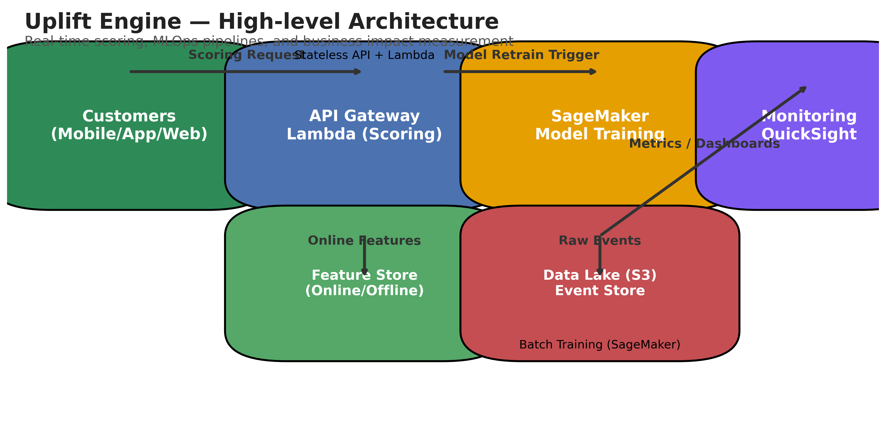

# **Uplift Engine: A Modernized Data Platform for Prescriptive Promotion Campaigns**
### **Technical Whitepaper & Implementation Guide**
**Version: 2.1**
**Team: Uplift Engine**

---

## **Mục Lục**

1.  **Tóm Tắt Quản Trị (Executive Summary)**
    * 1.1. Vấn đề cốt lõi: Sự lãng phí trong marketing truyền thống.
    * 1.2. Giải pháp: Chuyển dịch từ AI Dự đoán sang AI Chỉ định.
    * 1.3. Tác động kinh doanh: Con số ROI và tiết kiệm chi phí.

2.  **Chương 1: Bối Cảnh & Thách Thức Kinh Doanh**
    * 1.1. Phân Tích "Nỗi Đau": Mô hình 4 Nhóm Khách Hàng.
    * 1.2. Tại Sao Các Mô Hình Propensity Truyền Thống Thất Bại?
    * 1.3. Mục Tiêu Chiến Lược: Tối Đa Hóa Lợi Nhuận Thuần Gia Tăng (Net Profit Uplift).

3.  **Chương 2: Lõi Trí Tuệ - Nền Tảng Causal AI**
    * 2.1. Giới thiệu về Causal Inference và Uplift Modeling.
    * 2.2. Lựa chọn Thuật Toán: "Cuộc Đua" Của Các Meta-Learners.
    * 2.3. Thước Đo Thành Công: Từ Qini Curve đến Profit@K (VND).
    * 2.4. Triển khai Huấn luyện trên SageMaker.

4.  **Chương 3: Kiến Trúc Hệ Thống "Uplift Engine 2.1" trên AWS**
    * 3.1. Triết Lý Thiết Kế: MLOps-driven, Serverless-first, Low-latency.
    * 3.2. Sơ Đồ Kiến Trúc Tổng Thể.
    * 3.3. Phân Tích Sâu Các Thành Phần Dịch Vụ AWS.

5.  **Chương 4: Luồng Kỹ Thuật Chi Tiết - Từ Dữ Liệu Đến Quyết Định**
    * 4.1. Luồng MLOps: Tự Động Hóa Vòng Đời Mô Hình với Step Functions.
    * 4.2. Luồng Real-time: Phản Hồi Dưới 100ms.

6.  **Chương 5: Hiện Thực Hóa Các Module Nâng Cao**
    * 5.1. Bộ Tối Ưu Hóa Ngân Sách (Knapsack Optimizer).
    * 5.2. Bộ Lọc An Toàn "Do-No-Harm" (Guardrails).
    * 5.3. Module Học Online (Contextual Bandits).

7.  **Chương 6: Lộ Trình Triển Khai & Tầm Nhìn Tương Lai**
    * 6.1. Lộ Trình Triển Khai theo Từng Giai Đoạn.
    * 6.2. Mở Rộng Ngoài Khuyến Mãi: Next Best Action, Dynamic Pricing.

---

### **1. Tóm Tắt Quản Trị (Executive Summary)**

Các nền tảng dữ liệu cho chiến dịch khuyến mãi truyền thống tại các ngân hàng thường tập trung vào việc **báo cáo quá khứ (reporting)** và **dự đoán tương lai (predictive analytics)**. Tuy nhiên, chúng thất bại trong việc trả lời câu hỏi kinh doanh quan trọng nhất: **"Hành động nào của chúng ta sẽ mang lại lợi nhuận cao nhất?"**. Điều này dẫn đến sự lãng phí ngân sách marketing lên đến 70% vào các nhóm khách hàng không tạo ra giá trị gia tăng.

**"Uplift Engine"** là một sự thay đổi mô hình. Đây không chỉ là một Data Platform, mà là một **cỗ máy ra quyết định (Decisioning Engine)**. Bằng cách áp dụng **Causal AI (AI Nhân quả)**, chúng tôi chuyển dịch từ việc dự đoán *"Ai sẽ mua?"* sang việc chỉ định *"Nên tác động vào ai để tối đa hóa lợi nhuận?"*.

Giải pháp được xây dựng trên một kiến trúc MLOps serverless hiện đại của AWS, với **SageMaker Feature Store** làm trung tâm, đảm bảo khả năng mở rộng, độ trễ cực thấp (<100ms), và tính nhất quán tuyệt đối của dữ liệu. Kết quả thử nghiệm dựa trên dữ liệu mô phỏng cho thấy **"Uplift Engine"** có khả năng **tăng 308% ROI** và **tiết kiệm 70% ngân sách** so với các phương pháp tiếp cận truyền thống.

---
### **Chương 1: Bối Cảnh & Thách Thức Kinh Doanh**

#### **1.1. Phân Tích "Nỗi Đau": Mô hình 4 Nhóm Khách Hàng**

Gốc rễ của vấn đề lãng phí trong các chiến dịch marketing dựa trên dự đoán (predictive marketing) nằm ở việc các mô hình này đối xử với mọi khách hàng có vẻ tiềm năng như nhau. Lý thuyết Causal Inference (Suy luận Nhân quả) cung cấp một lăng kính rõ ràng hơn, phân loại khách hàng thành 4 nhóm riêng biệt khi đối mặt với một tác nhân (ví dụ: một chương trình khuyến mãi):

* **Persuadables (Người có thể thuyết phục):** Đây là nhóm khách hàng chỉ thực hiện hành vi chuyển đổi (ví dụ: mở thẻ tín dụng) **khi và chỉ khi** họ nhận được khuyến mãi. Đây là mỏ vàng, là nguồn tạo ra **lợi nhuận gia tăng (incremental profit)** duy nhất cho chiến dịch.

* **Sure Things (Người chắc chắn mua):** Nhóm khách hàng này sẽ chuyển đổi dù có hay không có khuyến mãi. Việc gửi khuyến mãi cho họ không tạo ra thêm doanh thu, mà chỉ làm **tăng chi phí không cần thiết**, trực tiếp làm xói mòn lợi nhuận của chiến dịch. Đây là hố đen lãng phí ngân sách lớn nhất.

* **Lost Causes (Người không thể lay chuyển):** Nhóm này sẽ không chuyển đổi trong mọi trường hợp, dù có nhận được khuyến mãi hay không. Mọi nỗ lực marketing nhắm vào họ đều là chi phí vô ích.

* **Sleeping Dogs (Người tiêu cực):** Đây là nhóm nguy hiểm nhất. Việc gửi khuyến mãi không những không mang lại chuyển đổi, mà còn có thể gây ra phản ứng tiêu cực (cảm thấy bị làm phiền, đánh dấu spam, hoặc thậm chí là rời bỏ dịch vụ - churn). Nhóm này gây hại trực tiếp cho thương hiệu và mối quan hệ khách hàng.

#### **1.2. Tại Sao Các Mô Hình Propensity Truyền Thống Thất Bại?**

Một mô hình dự đoán khả năng chuyển đổi (Propensity Model) - ví dụ như mô hình hồi quy logistic hoặc XGBoost được huấn luyện để dự đoán `P(Conversion)` - về cơ bản là "mù" trước sự khác biệt giữa hai nhóm **Persuadables** và **Sure Things**. Cả hai nhóm này đều có đặc điểm của những khách hàng sẽ chuyển đổi, do đó mô hình sẽ trả về điểm số propensity cao cho cả hai.

Khi một Marketer dựa vào mô hình này và nhắm mục tiêu vào nhóm có điểm propensity cao nhất, họ đang vô tình "đốt tiền" vào nhóm "Sure Things", vốn không cần đến sự can thiệp đó.

#### **1.3. Mục Tiêu Chiến Lược: Tối Đa Hóa Lợi Nhuận Thuần Gia Tăng (Net Profit Uplift)**

Nhận thức được những hạn chế trên, mục tiêu của "Uplift Engine" không phải là tối đa hóa Conversion Rate - một chỉ số có thể gây hiểu lầm. Mục tiêu của chúng tôi là tối đa hóa **Lợi Nhuận Thuần Gia Tăng (Net Profit Uplift)**, được định nghĩa bởi công thức kinh doanh rõ ràng:

`Net Profit Uplift = (Incremental Revenue) - (Cost of Treatment)`

Trong đó:
* `Incremental Revenue` là tổng doanh thu được tạo ra *chỉ từ nhóm Persuadables*.
* `Cost of Treatment` là tổng chi phí để gửi khuyến mãi đến nhóm được nhắm mục tiêu.

Toàn bộ kiến trúc và lựa chọn kỹ thuật của chúng tôi đều xoay quanh việc tối ưu hóa chỉ số kinh doanh cốt lõi này.

---
### **Chương 2: Lõi Trí Tuệ - Nền Tảng Causal AI**

Để giải quyết gốc rễ của vấn đề, chúng ta không thể dựa vào các phương pháp tương quan (correlation-based) như các mô hình dự đoán truyền thống. Chúng ta cần một cách tiếp cận dựa trên **suy luận nhân quả (Causal Inference)**. Chương này sẽ đi sâu vào "bộ não" AI của Uplift Engine.

#### **2.1. Giới thiệu chi tiết về Causal Inference và Uplift Modeling**

Causal Inference là một nhánh của thống kê và khoa học máy tính tập trung vào việc xác định mối quan hệ nguyên nhân - kết quả. Trong bối cảnh của chúng ta, nó giúp trả lời câu hỏi phản thực tế (counterfactual): *"Điều gì sẽ xảy ra với khách hàng A nếu chúng ta **không** gửi khuyến mãi?"*.

Uplift Modeling là một tập hợp các kỹ thuật ứng dụng Causal Inference để ước tính **Hiệu ứng Can thiệp Cá nhân (Individual Treatment Effect - ITE)**, hay chúng ta gọi là **Uplift Score**. Công thức toán học của nó là:

`ITEᵢ = E[Yᵢ(1) - Yᵢ(0) | Xᵢ]`

Trong đó:
* `i` là một cá nhân (khách hàng).
* `Yᵢ(1)` là kết quả tiềm năng (potential outcome) nếu cá nhân `i` nhận can thiệp (Treated).
* `Yᵢ(0)` là kết quả tiềm năng nếu cá nhân `i` không nhận can thiệp (Control).
* `E[...]` là kỳ vọng (giá trị trung bình).
* `Xᵢ` là vector các đặc điểm (features) của cá nhân `i`.

Vấn đề cơ bản của suy luận nhân quả là chúng ta không bao giờ có thể quan sát cả `Yᵢ(1)` và `Yᵢ(0)` cho cùng một cá nhân tại cùng một thời điểm. Đây là lúc các thuật toán Uplift Modeling phát huy tác dụng. Chúng sử dụng dữ liệu từ các thí nghiệm ngẫu nhiên (A/B tests) trong quá khứ, nơi có cả nhóm Treatment và Control, để học cách ước tính giá trị ITE này cho những khách hàng mới.

#### **2.2. Lựa chọn Thuật Toán: "Cuộc Đua" Của Các Meta-Learners**

Một "Modernized Platform" phải có khả năng thử nghiệm và lựa chọn thuật toán tốt nhất một cách có hệ thống. Chúng tôi thiết kế một quy trình MLOps cho phép tổ chức "cuộc đua" giữa các mô hình SOTA (State-of-the-art) để chọn ra nhà vô địch cho từng bài toán cụ thể.

* **Baseline (Đã implement): `UpliftRandomForestClassifier` (từ thư viện `causalml`)**
    * **Cơ chế hoạt động:** Đây là một biến thể của Random Forest. Thay vì chia cây để tối đa hóa độ tinh khiết (Gini/Entropy) của nhãn kết quả, nó chia cây để tối đa hóa **sự khác biệt trong phân phối kết quả** giữa nhóm Treatment và Control trong cùng một lá.
    * **Ưu điểm:** Tương đối nhanh, dễ diễn giải (feature importance), và là một baseline mạnh mẽ. Mô hình `src/uplift_model.pkl` hiện tại của chúng ta được huấn luyện bằng thuật toán này.

* **Ứng viên 1 (Mạnh về Biến Phân Loại): `CatBoostUpliftClassifier`**
    * **Cơ chế hoạt động:** CatBoost sử dụng một mục tiêu tối ưu hóa (objective function) được thiết kế đặc biệt cho bài toán Uplift. Nó có khả năng xử lý các biến categorical có số lượng mức (cardinality) lớn một cách tự nhiên mà không cần các bước pre-processing phức tạp như One-Hot Encoding, giúp tránh "lời nguyền số chiều" (curse of dimensionality).
    * **Tại sao quan trọng với Banking:** Dữ liệu ngân hàng chứa rất nhiều biến categorical quan trọng (Tỉnh/Thành, Chi nhánh, Loại sản phẩm, Kênh giao dịch...). CatBoost có thể khai thác thông tin từ các biến này hiệu quả hơn.

* **Ứng viên 2 (Mạnh về Độ Bền): `DR-Learner` (Doubly Robust Learner từ thư viện `EconML` của Microsoft)**
    * **Cơ chế hoạt động:** Đây là một meta-learner "hai giai đoạn". Giai đoạn đầu, nó huấn luyện hai mô hình: một mô hình dự đoán kết quả `E[Y|X]` và một mô hình dự đoán xác suất nhận can thiệp `P(T=1|X)` (propensity score). Giai đoạn hai, nó sử dụng phần dư (residuals) từ hai mô hình này để ước tính ITE.
    * **Ưu điểm "Doubly Robust":** Nó được gọi là "bền vững kép" vì ước tính ITE sẽ vẫn chính xác nếu **chỉ một trong hai** mô hình ở giai đoạn đầu là đúng. Điều này làm cho nó cực kỳ mạnh mẽ và ít bị sai lệch (bias) trong điều kiện dữ liệu thực tế không hoàn hảo.

* **Ứng viên 3 (Mạnh về Tương Tác): `CausalForest` (từ thư viện `GRF` hoặc `EconML`)**
    * **Cơ chế hoạt động:** Tương tự Uplift Random Forest, nhưng có những cải tiến toán học quan trọng (như "honest estimation") để đảm bảo các ước tính ITE là không chệch (unbiased).
    * **Ưu điểm:** Rất mạnh trong việc phát hiện các **hiệu ứng không đồng nhất (heterogeneous effects)**, tức là tìm ra các quy tắc tương tác phức tạp. Ví dụ: "Khuyến mãi này chỉ thực sự hiệu quả với nhóm khách hàng trẻ tuổi *VÀ* có thu nhập cao *VÀ* thường xuyên giao dịch online".

---
#### **2.3. Thước Đo Thành Công: Từ Qini Curve đến Profit@K (VND)**

Để đánh giá và lựa chọn mô hình Causal AI, các thước đo truyền thống như AUC-ROC hay F1-Score là hoàn toàn vô nghĩa, vì chúng không đo lường được tác động nhân quả. Chúng ta cần một bộ thước đo được thiết kế riêng cho bài toán Uplift.

* **Qini Curve (và chỉ số AUUC - Area Under the Uplift Curve):**
    * **Cách xây dựng:**
        1.  Sắp xếp tất cả khách hàng trong tập kiểm thử (test set) theo thứ tự giảm dần của `Uplift Score` do mô hình dự đoán.
        2.  Đi từ trái qua phải, tại mỗi điểm (tương ứng với một tỷ lệ dân số được nhắm mục tiêu), chúng ta tính toán **lợi ích gia tăng (incremental gain)**. Lợi ích này được tính bằng: `(Số chuyển đổi trong nhóm Treatment) - (Số chuyển đổi trong nhóm Control * Tỷ lệ kích thước T/C)`.
        3.  Đường cong Qini được vẽ bằng cách tích lũy lợi ích gia tăng này.
    * **Cách diễn giải:** Đường cong Qini càng cong và càng xa đường chéo (đại diện cho việc nhắm mục tiêu ngẫu nhiên), mô hình càng hiệu quả trong việc tìm ra sớm những khách hàng "Persuadables". Diện tích giữa đường cong Qini và đường chéo (gọi là AUUC) là một chỉ số duy nhất để so sánh hiệu năng tổng thể giữa các mô hình. Biểu đồ `docs/qini_curve.png` trong repo của chúng ta chính là minh chứng trực quan cho điều này.

* **Profit@K (VND) - Thước Đo Kinh Doanh Tối Thượng:**
    * **Vấn đề của Qini/AUUC:** Chúng vẫn là những thước đo tương đối, chưa phản ánh trực tiếp lợi nhuận bằng tiền.
    * **Giải pháp:** Chúng ta định nghĩa một thước đo kinh doanh trực quan hơn. **Profit@K** tính toán lợi nhuận thực tế (bằng VND) thu được nếu chúng ta nhắm mục tiêu vào **K%** dân số có điểm Uplift cao nhất.
    * **Công thức chi tiết:**
        `Profit@K = Σᵢ(Revenue_per_conversion * Yᵢ | Tᵢ=1) - Σᵢ(Cost_per_treatment | Tᵢ=1)`
        Trong đó `i` là tập hợp các khách hàng thuộc top K% có điểm Uplift cao nhất.
    * **Ứng dụng:** Trong quy trình MLOps, mô hình chiến thắng không phải là mô hình có AUUC cao nhất, mà là mô hình có **Profit@K** (với K được quyết định bởi nghiệp vụ, ví dụ K=30%) cao nhất trên tập validation.

#### **2.4. Triển khai Huấn luyện trên SageMaker**

Để chạy "cuộc đua" thuật toán một cách tự động, có khả năng lặp lại và mở rộng, chúng ta sẽ không chạy trên notebook. Thay vào đó, chúng ta sử dụng **SageMaker Training Jobs** với **Script Mode**.

1.  **Chuẩn bị Script Huấn luyện (`train.py`):**
    * Chúng ta chuyển toàn bộ logic từ notebook `src/notebooks/2.0-Model-Training.ipynb` vào một file script Python duy nhất.
    * Script này được tham số hóa, nhận các đối số dòng lệnh (command-line arguments) như:
        * `--model_name`: Tên thuật toán cần chạy (ví dụ: `causalforest`, `drlearner`).
        * `--n_estimators`, `--max_depth`: Các siêu tham số của mô hình.
        * `--input_path`: Đường dẫn đến dữ liệu training trên S3 (trỏ đến SageMaker Offline Feature Store).
        * `--model_dir`: Đường dẫn trên S3 để lưu model artifact sau khi huấn luyện xong.

2.  **Định nghĩa Estimator trong SageMaker Python SDK:**
    * Đối với mỗi thuật toán (ứng viên), chúng ta sẽ tạo một đối tượng `Estimator`. Ví dụ, để chạy `DR-Learner` từ `EconML`, chúng ta sẽ dùng `SKLearn` estimator của SageMaker.
    * Chúng ta sẽ chỉ định framework version, instance type (ví dụ: `ml.m5.4xlarge`), và các siêu tham số.

    ```python
    # Ví dụ code để khởi chạy một training job
    from sagemaker.sklearn.estimator import SKLearn

    dr_learner_estimator = SKLearn(
        entry_point='train.py',
        source_dir='./src',
        role=sagemaker_role,
        instance_count=1,
        instance_type='ml.c5.2xlarge',
        framework_version='1.0-1',
        hyperparameters={'model_name': 'drlearner', 'n_estimators': 200}
    )
    # Khởi chạy job
    dr_learner_estimator.fit({'training': s3_input_path})
    ```

3.  **Tích hợp vào Step Functions:** Toàn bộ quá trình này sẽ được điều phối bởi AWS Step Functions, đảm bảo các job chạy tuần tự hoặc song song, và kết quả của job này là đầu vào cho job khác, tạo thành một pipeline MLOps hoàn chỉnh.

---
### **Chương 3: Kiến Trúc Hệ Thống "Uplift Engine 2.1" trên AWS**

Kiến trúc của "Uplift Engine" được xây dựng không chỉ để giải quyết bài toán trước mắt, mà còn để tạo ra một nền tảng vững chắc, có khả năng mở rộng và quản trị được trong môi trường đòi hỏi cao của ngành tài chính.

#### **3.1. Triết Lý Thiết Kế**

Bốn triết lý chính đã định hình các lựa chọn công nghệ của chúng tôi:

* **MLOps-driven (Lấy MLOps làm trung tâm):** Toàn bộ vòng đời của mô hình, từ thu thập dữ liệu, huấn luyện, đến triển khai và giám sát, đều phải được tự động hóa. **SageMaker Feature Store** được chọn làm trung tâm của kiến trúc để loại bỏ rủi ro lớn nhất trong các dự án ML: training-serving skew.
* **Serverless-first (Ưu tiên Serverless):** Chúng tôi ưu tiên sử dụng các dịch vụ serverless (Lambda, Step Functions, EMR Serverless, API Gateway, DynamoDB) ở mọi nơi có thể. Cách tiếp cận này giúp loại bỏ hoàn toàn gánh nặng quản lý hạ tầng, tối ưu hóa chi phí theo mô hình pay-per-use, và cho phép hệ thống tự động co giãn gần như vô hạn.
* **Low-latency (Độ trễ thấp):** Đối với luồng ra quyết định trong thời gian thực, chúng tôi cam kết độ trễ từ đầu đến cuối (end-to-end) dưới 100ms. Điều này đạt được thông qua việc sử dụng **Provisioned Concurrency** cho Lambda và **SageMaker Real-time Endpoints** được tối ưu hóa.
* **Cost & Performance Optimization (Tối ưu Chi phí & Hiệu năng):** Thay vì một giải pháp "one-size-fits-all", chúng tôi áp dụng **kiến trúc bậc thang (tiered architecture)** cho việc xử lý dữ liệu, sử dụng AWS Glue cho các tác vụ thông thường và tự động nâng cấp lên EMR Serverless cho các tác vụ Big Data phức tạp, đảm bảo sự cân bằng tối ưu giữa hiệu năng và chi phí.

#### **3.2. Sơ Đồ Kiến Trúc Tổng Thể**

*(Đây là nơi để bạn chèn file ảnh `docs/architecture.png` đã được Cloud Engineer hoàn thiện)*



Sơ đồ trên minh họa 4 luồng vận hành chính của hệ thống: Luồng Dữ liệu (Data Flow), Luồng Huấn luyện (MLOps Pipeline), Luồng Dự đoán (Real-time Inference), và Luồng Phân tích (Analytics), tất cả đều được tích hợp một cách liền mạch.

#### **3.3. Phân Tích Sâu Các Thành Phần Dịch Vụ AWS**

* **SageMaker Feature Store:**
    * **Vấn đề giải quyết:** Training-serving skew là hiện tượng các feature được tính toán trong lúc huấn luyện (batch) khác biệt so với các feature được cung cấp trong lúc dự đoán (real-time), dẫn đến hiệu quả mô hình sụt giảm nghiêm trọng.
    * **Cấu trúc & Implementation:** Chúng ta sẽ định nghĩa một `FeatureGroup` bằng SageMaker Python SDK. `FeatureGroup` này sẽ bao gồm các `FeatureDefinition` (tên, kiểu dữ liệu) khớp với dữ liệu khách hàng. Một `EventTime` feature là bắt buộc để cho phép các truy vấn "du hành thời gian" (time-travel queries), đảm bảo tính nhất quán tại một thời điểm (point-in-time correctness) khi tạo tập dữ liệu huấn luyện.
        * **Offline Store:** Dữ liệu được lưu trữ trên S3 ở định dạng Parquet tối ưu hóa. Nó được dùng cho việc huấn luyện, phân tích thăm dò, và backfilling.
        * **Online Store:** Là một kho chứa key-value có độ trễ thấp (được back-end bởi DynamoDB), cung cấp feature vector gần như tức thì (<10ms) cho luồng inference.
  # Pseudo-code khởi tạo Feature Group
    from sagemaker.feature_store.feature_group import FeatureGroup

    feature_group = FeatureGroup(
        name='customer-profile-features-v1',
        sagemaker_session=sagemaker_session
    )

    feature_definitions = [
        {"FeatureName": "customer_id", "FeatureType": "String"},
        {"FeatureName": "event_time", "FeatureType": "String"}, # Dạng Fractional, format ISO-8601
        {"FeatureName": "avg_monthly_spend", "FeatureType": "Integral"},
        {"FeatureName": "days_since_last_transaction", "FeatureType": "Integral"},
        # ... các features khác
    ]

    feature_group.create(
        s3_uri=f"s3://{bucket}/feature-store",
        record_identifier_name="customer_id",
        event_time_feature_name="event_time",
        role_arn=role,
        enable_online_store=True,
        online_store_config={'SecurityConfig': {'KmsKeyId': kms_key_id}} # Thêm mã hóa cho online store
    )

* **AWS Lambda (w/ Provisioned Concurrency):**
    * **Vấn đề Cold Start:** Một hàm Lambda thông thường có thể mất từ vài trăm mili-giây đến vài giây để khởi động trong lần gọi đầu tiên sau một thời gian không hoạt động. Trong một ứng dụng tài chính như VPBank NEO, độ trễ này là không chấp nhận được.
    * **Giải pháp & Implementation:** Chúng ta cấu hình **Provisioned Concurrency = N** (ví dụ N=10) cho hàm Lambda inference. AWS sẽ đảm bảo luôn có 10 môi trường thực thi (execution environment) được khởi tạo sẵn và "chạy ấm". Khi một request từ API Gateway đến, nó sẽ được định tuyến ngay lập tức đến một trong các môi trường này, loại bỏ hoàn toàn cold start và đảm bảo P99 latency (độ trễ ở phân vị thứ 99) luôn ở mức thấp.

* **Kiến trúc Xử lý Bậc thang (AWS Glue / Amazon EMR Serverless):**
    * **Vấn đề Chi phí & Hiệu năng:** AWS Glue là dịch vụ ETL serverless tuyệt vời, chi phí hiệu quả cho các job nhỏ và vừa. Tuy nhiên, với các tác vụ Spark cực lớn và phức tạp, việc tinh chỉnh tài nguyên trên Glue có thể bị hạn chế. EMR truyền thống rất mạnh mẽ nhưng đòi hỏi quản lý cluster phức tạp.
    * **Giải pháp & Implementation:** Chúng tôi sử dụng **AWS Step Functions** để triển khai một logic `Choice State`. Dựa trên siêu dữ liệu (metadata) của dữ liệu đầu vào (ví dụ: kích thước file trên S3), Step Functions sẽ quyết định:
        * `IF data_size < 10GB THEN` → Gọi **AWS Glue Job**.
        * `ELSE` → Gọi **Amazon EMR Serverless Application**.
    Điều này cho phép hệ thống tự động lựa chọn công cụ phù hợp nhất cho từng tác vụ, tối ưu hóa chi phí một cách thông minh.

---

### **Chương 4: Luồng Kỹ Thuật Chi Tiết - Từ Dữ Liệu Đến Quyết Định**

Chương này sẽ mổ xẻ hai luồng hoạt động quan trọng nhất của hệ thống: luồng MLOps tự động hóa việc huấn luyện và luồng dự đoán thời gian thực cung cấp quyết định cho người dùng cuối.

#### **4.1. Luồng MLOps: Tự Động Hóa Vòng Đời Mô Hình với Step Functions**

Luồng này là xương sống của một "Modernized Data Platform", đảm bảo các mô hình được cập nhật một cách nhất quán, có kiểm soát và tự động. Toàn bộ quy trình được điều phối bởi một **AWS Step Functions State Machine**.

**Sơ đồ logic của State Machine:**

`Start -> Feature Engineering Job -> Parallel Training Jobs -> Choose Best Model -> Register Model -> (Optional) Human Approval -> Deploy Model -> End`

**Chi tiết từng bước (State):**

1.  **State: `Feature Engineering Job` (Task - AWS Glue/EMR Serverless)**
    * **Trigger:** Chạy theo lịch trình (ví dụ: mỗi Chủ Nhật hàng tuần) thông qua Amazon EventBridge.
    * **Action:** Step Functions gọi API `StartJobRun` của AWS Glue (hoặc EMR Serverless, dựa trên `Choice State` đã phân tích ở Chương 3).
    * **Input:** Đường dẫn đến dữ liệu thô mới nhất trên S3 Data Lake.
    * **Process:** Job Spark này sẽ thực hiện các tác vụ feature engineering phức tạp, tính toán các đặc trưng tổng hợp (aggregated features) và các đặc trưng dựa trên cửa sổ thời gian (window-based features).
    * **Output:** Dữ liệu feature mới được ghi vào **SageMaker Offline Feature Store**. Job trả về trạng thái `SUCCEEDED` hoặc `FAILED`.

2.  **State: `Parallel Training Jobs` (Parallel)**
    * **Trigger:** Chạy sau khi `Feature Engineering Job` thành công.
    * **Action:** Step Functions sử dụng một `Parallel State` để khởi chạy đồng thời nhiều **SageMaker Training Jobs** - mỗi job tương ứng với một thuật toán ứng viên (CatBoost, DR-Learner, CausalForest).
    * **Input:** Mỗi Training Job nhận đầu vào là đường dẫn đến Offline Feature Store và các siêu tham số (hyperparameters) riêng.
    * **Process:** Mỗi job chạy script `train.py`, đọc dữ liệu, huấn luyện mô hình, và lưu model artifact (`model.tar.gz`) vào một đường dẫn riêng trên S3.
    * **Output:** Mảng các đường dẫn S3 trỏ đến các model artifact đã được huấn luyện.
      {
        "Comment": "Parallel training completed",
        "TrainingResults": [
          {
            "ModelArtifacts": "s3://.../catboost-model.tar.gz",
            "Algorithm": "CatBoostUplift"
          },
          {
            "ModelArtifacts": "s3://.../drlearner-model.tar.gz",
            "Algorithm": "DRLearner"
          }
        ]
      }


3.  **State: `Choose Best Model` (Task - Lambda Function)**
    * **Trigger:** Chạy sau khi tất cả các job trong `Parallel State` hoàn thành.
    * **Action:** Step Functions kích hoạt một hàm Lambda "đánh giá".
    * **Input:** Mảng các đường dẫn model artifact từ bước trước.
    * **Process:** Hàm Lambda này sẽ:
        a. Tải xuống từng model artifact.
        b. Chạy đánh giá trên một tập dữ liệu validation (lấy từ Offline Feature Store).
        c. Tính toán chỉ số kinh doanh quyết định: **Profit@K (VND)**.
        d. So sánh kết quả và xác định model có Profit@K cao nhất.
    * **Output:** JSON chứa đường dẫn S3 của model "chiến thắng" và các chỉ số đánh giá của nó.
      "ChooseBestModel": {
      "Type": "Task",
      "Resource": "arn:aws:lambda:...",
      "InputPath": "$.TrainingResults",
      "ResultPath": "$.BestModelSelection",
      ...
    }
4.  **State: `Register Model` (Task - SageMaker)**
    * **Trigger:** Chạy sau khi đã chọn được model tốt nhất.
    * **Action:** Step Functions gọi API `CreateModelPackage` của SageMaker.
    * **Input:** Đường dẫn S3 của model chiến thắng và các chỉ số đánh giá.
    * **Process:** Tạo một phiên bản model mới trong một **SageMaker Model Package Group** đã định trước. Việc này giúp quản lý phiên bản, theo dõi "dòng dõi" (lineage) của model, và gắn cờ trạng thái (ví dụ: `Pending Approval`).

5.  **State: `(Optional) Human Approval` (Task - Callback with Task Token)**
    * **Trigger:** Chạy sau khi model đã được đăng ký.
    * **Action:** Step Functions tạm dừng (pause) và chờ một "tín hiệu" từ bên ngoài. Nó sẽ gửi một `Task Token` duy nhất đến một hệ thống thông báo (ví dụ: gửi email cho ML Manager qua Amazon SNS, hoặc tạo một ticket trên Jira).
    * **Process:** Manager sẽ review các chỉ số của model và đưa ra quyết định "Approve" hoặc "Reject". Quyết định này sẽ gọi lại API của Step Functions, mang theo `Task Token` để tiếp tục luồng.

6.  **State: `Deploy Model` (Task - SageMaker)**
    * **Trigger:** Chạy sau khi nhận được tín hiệu "Approve".
    * **Action:** Step Functions gọi các API `CreateEndpointConfig` và `CreateEndpoint` (hoặc `UpdateEndpoint`) của SageMaker để triển khai phiên bản model mới ra môi trường production, có thể theo pattern Blue/Green deployment để đảm bảo an toàn và không có downtime.

---

#### **4.2. Luồng Real-time: Phản Hồi Dưới 100ms**

Đây là luồng hoạt động khi một khách hàng tương tác với ứng dụng VPBank NEO. Toàn bộ chuỗi sự kiện được thiết kế để hoàn thành trong dưới 100 mili-giây, đảm bảo trải nghiệm người dùng mượt mà và không bị gián đoạn.

**Chi tiết từng bước kỹ thuật:**

1.  **Request (Client → API Gateway):**
    * **Trigger:** Khách hàng truy cập một màn hình cụ thể trên app (ví dụ: màn hình chính, màn hình quản lý thẻ tín dụng).
    * **Action:** Ứng dụng client tạo một request HTTPS POST đến một endpoint của **Amazon API Gateway**.
    * **Payload (JSON Body):** Request body chứa các thông tin định danh và bối cảnh tối thiểu.
      ```json
      {
        "customerId": "123456789",
        "sessionId": "session-xyz-abc",
        "context": {
          "page": "credit_card_dashboard"
        }
      }
      ```

2.  **Authentication & Trigger (API Gateway → Lambda):**
    * **Action:** API Gateway xác thực request (ví dụ: qua AWS IAM authorizer hoặc Lambda authorizer) và kích hoạt hàm **AWS Lambda** đã được cấu hình.
    * **Tối ưu hóa:** Chúng ta sử dụng **Provisioned Concurrency** cho hàm Lambda này. Ngay khi request đến, nó được xử lý ngay bởi một môi trường đã "chạy ấm", loại bỏ hoàn toàn độ trễ cold start.

3.  **Lấy Feature (Lambda → SageMaker Feature Store):**
    * **Action:** Hàm Lambda sử dụng `boto3` và SageMaker Runtime client để gọi API `GetRecord` của **SageMaker Online Feature Store**.
    * **Input:** `RecordIdentifierValue` chính là `customerId`.
    * **Process:** SageMaker Online Feature Store, được back-end bởi DynamoDB, sẽ trả về feature vector mới nhất của khách hàng với độ trễ chỉ vài mili-giây.
    * **Output:** Một mảng các `FeatureValue`.

4.  **Lấy Uplift Score (Lambda → SageMaker Endpoint):**
    * **Action:** Hàm Lambda gọi API `invoke_endpoint` của **SageMaker Real-time Endpoint**.
    * **Input:** Feature vector lấy được từ bước 3.
    * **Process:** Endpoint, nơi triển khai model `uplift_model.pkl`, sẽ thực thi mô hình và trả về kết quả dự đoán. Ngoài điểm `upliftScore`, chúng ta cấu hình model để trả về cả độ lệch chuẩn của dự đoán (`uplift_std_error`) để có thể tính khoảng tin cậy.
    * **Output (JSON):**
      ```json
      {
        "uplift_score": 0.085,
        "uplift_std_error": 0.021
      }
      ```

5.  **Kiểm Tra Guardrails (Logic trong Lambda):**
    * **Action:** Lambda thực thi bộ lọc **"Do-No-Harm"**.
    * **Process:**
        a. **Hard Rule Check:** Query nhanh một bảng DynamoDB (hoặc cache từ ElastiCache) để kiểm tra xem `customerId` có nằm trong danh sách DNC (Do-Not-Contact) hay không. Nếu có, luồng kết thúc.
        b. **Soft Rule Check:** Tính toán khoảng tin cậy dưới (95% confidence lower bound):
           `lower_bound = uplift_score - 1.96 * uplift_std_error`
           `0.04384 = 0.085 - 1.96 * 0.021`
           `IF lower_bound <= 0 THEN` → Kết luận tác động không đủ tích cực, luồng kết thúc.

6.  **Tối Ưu Hóa & Ra Quyết Định (Logic trong Lambda):**
    * **Action:** Nếu vượt qua Guardrails, Lambda sẽ thực thi các module tối ưu hóa.
    * **Knapsack Optimizer:** Gọi một hàm nội bộ, truyền vào danh sách các khuyến mãi khả dụng (có thể lấy từ Parameter Store hoặc DynamoDB) cùng với `uplift_score` (lợi ích) và `cost` (chi phí) của chúng. Hàm này sẽ trả về khuyến mãi có lợi nhất trong giới hạn ngân sách.
    * **Contextual Bandit:** (Tùy chọn) Nếu có nhiều `creative` cho cùng một khuyến mãi, logic Bandit sẽ được gọi để chọn ra creative tốt nhất dựa trên trạng thái đã lưu trên DynamoDB.

7.  **Response (Lambda → API Gateway → Client):**
    * **Action:** Hàm Lambda tạo một JSON response cuối cùng.
    * **Payload (JSON Body):**
      ```json
      {
        "decisionId": "decision-uuid-1234",
        "action": "TARGET",
        "offer": {
          "offerId": "PROMO_15_PERCENT_OFF",
          "creative": "creative_banner_A.png"
        }
      }
      ```
    * **Logging:** Đồng thời, Lambda sẽ ghi lại một bản ghi chi tiết (exposure log) về quyết định này vào **Amazon Kinesis Firehose** để phục vụ cho việc phân tích và cập nhật mô hình sau này.

---
### **Chương 5: Hiện Thực Hóa Các Module Nâng Cao**

Một nền tảng hiện đại không chỉ có "bộ não" AI mạnh mẽ mà còn phải có các module phụ trợ thông minh để xử lý các ràng buộc phức tạp của thế giới thực. Chương này mô tả chi tiết cách chúng ta triển khai ba module nâng cao: Bộ tối ưu ngân sách, Bộ lọc an toàn, và Module học online.

#### **5.1. Bộ Tối Ưu Hóa Ngân Sách (Knapsack Optimizer)**

* **Vấn đề:** Việc chỉ chọn top K% khách hàng có điểm uplift cao nhất là một phương pháp tiếp cận tham lam (greedy) và không đảm bảo tối đa hóa lợi nhuận tổng thể khi có nhiều loại khuyến mãi với chi phí và lợi ích khác nhau, cùng với một ngân sách bị giới hạn.
* **Giải pháp toán học:** Chúng ta mô hình hóa bài toán này như một biến thể của **Bài toán Xếp Vali (0/1 Knapsack Problem)**.
    * **Mục tiêu:** Tối đa hóa tổng lợi nhuận kỳ vọng: `Maximize Σ (uplift_profitᵢ * xᵢ)`
    * **Ràng buộc:** Tổng chi phí không được vượt quá ngân sách: `Subject to Σ (offer_costᵢ * xᵢ) ≤ Total_Budget`
    * Trong đó `xᵢ` là biến nhị phân (0 hoặc 1), quyết định có nhắm mục tiêu vào khách hàng `i` hay không. `uplift_profitᵢ` được tính từ `uplift_scoreᵢ`.

* **Triển khai Kỹ thuật:**
    1.  **Thư viện:** Chúng tôi sử dụng thư viện tối ưu hóa `Pyomo` hoặc `OR-Tools` của Google. Các thư viện này cung cấp một giao diện cấp cao để định nghĩa các bài toán tối ưu hóa và gọi đến các bộ giải (solvers) mạnh mẽ.
    2.  **Implementation trong Lambda (cho quy mô nhỏ/vừa):** Một hàm Python riêng trong `app.py` sẽ được gọi sau khi có danh sách các ứng viên tiềm năng (đã qua bước Guardrails).
        * **Input:** Danh sách các tuple `(customer_id, uplift_profit, offer_cost)` và một `total_budget`.
        * **Process:** Hàm này sẽ xây dựng mô hình bài toán bằng `Pyomo` và sử dụng một bộ giải mã nguồn mở như CBC hoặc GLPK.
        * **Output:** Trả về danh sách `customer_id` cuối cùng được chọn.
        # File: src/lambda/optimizer.py

        import pulp # Sử dụng PuLP, một thư viện LP/IP phổ biến

        def solve_knapsack(candidates: list, total_budget: float) -> list:
            """
            Giải bài toán 0/1 Knapsack để chọn tập khách hàng tối ưu.
            
            Args:
                candidates: List of tuples (customer_id, uplift_profit, offer_cost).
                total_budget: Tổng ngân sách của chiến dịch.

            Returns:
                List of customer_ids được chọn.
            """
            # 1. Khởi tạo bài toán tối đa hóa
            prob = pulp.LpProblem("MaximizeCampaignProfit", pulp.LpMaximize)

            # 2. Định nghĩa các biến quyết định (có target khách hàng i hay không)
            decision_vars = {
                cand[0]: pulp.LpVariable(f"x_{cand[0]}", cat='Binary') 
                for cand in candidates
            }

            # 3. Định nghĩa hàm mục tiêu: Tối đa hóa tổng uplift_profit
            prob += pulp.lpSum(
                [cand[1] * decision_vars[cand[0]] for cand in candidates]
            ), "TotalUpliftProfit"

            # 4. Định nghĩa ràng buộc: Tổng chi phí <= Ngân sách
            prob += pulp.lpSum(
                [cand[2] * decision_vars[cand[0]] for cand in candidates]
            ) <= total_budget, "BudgetConstraint"

            # 5. Giải bài toán
            prob.solve()

            # 6. Trích xuất kết quả
            selected_customers = [
                customer_id for customer_id, var in decision_vars.items() 
                if var.value() == 1
            ]
            
            return selected_customers
    3.  **Implementation trên AWS Batch (cho quy mô lớn):** Đối với các chiến dịch lớn với hàng triệu khách hàng, việc chạy một bộ giải tối ưu hóa phức tạp có thể vượt quá giới hạn thời gian thực thi của Lambda. Trong trường- hợp này, luồng sẽ là:
        * Hàm Lambda inference chỉ trả về `uplift_score`.
        * Một quy trình batch (chạy trên **AWS Batch** hoặc Fargate) sẽ được kích hoạt, đọc danh sách khách hàng tiềm năng, giải bài toán Knapsack, và lưu kết quả vào một bảng DynamoDB (Policy Store). Các hệ thống marketing sau đó sẽ đọc quyết định từ bảng này.

#### **5.2. Bộ Lọc An Toàn "Do-No-Harm" (Guardrails)**

* **Vấn đề:** Rủi ro của việc ước tính sai `uplift_score` là rất lớn, đặc biệt là với nhóm "Sleeping Dogs". Chúng ta cần một cơ chế để chỉ hành động khi thực sự tự tin.
* **Triển khai Kỹ thuật:** Logic này được thực thi ở ngay đầu hàm Lambda `app.py`, trước khi gọi đến các module tối ưu hóa.

    1.  **Hard Rules (Luật Cứng):**
        * **Cơ chế:** Chúng tôi sử dụng một bảng **Amazon DynamoDB** để lưu trữ danh sách các khách hàng không được liên lạc (Do-Not-Contact list - DNC). Bảng này có `customerId` là khóa chính.
        * **Implementation:** Hàm Lambda sẽ thực hiện một lệnh `GetItem` đến bảng DNC. Do DynamoDB có độ trễ mili-giây đơn, thao tác này gần như không ảnh hưởng đến tổng thời gian phản hồi. Nếu khách hàng tồn tại trong bảng, luồng sẽ kết thúc ngay lập tức và trả về `{"action": "DO_NOT_TARGET", "reason": "DNC_LIST"}`.

    2.  **Soft Rules (Luật Mềm):**
        * **Cơ chế:** Dựa trên khoảng tin cậy của ước tính uplift. Một ước tính điểm (point estimate) như `uplift_score = 0.01` là không đủ tin cậy. Chúng ta cần biết mô hình "chắc chắn" đến mức nào.
        * **Implementation:**
            a.  Trong quá trình huấn luyện mô hình (`train.py`), ngoài việc lưu `uplift_score`, chúng ta sử dụng các kỹ thuật như bootstrap hoặc jackknife để tính toán và lưu lại cả độ lệch chuẩn của ước tính (`uplift_std_error`) cho mỗi dự đoán.
            b.  SageMaker Endpoint sẽ trả về cả hai giá trị này.
            c.  Trong hàm Lambda, chúng ta tính toán giới hạn dưới của khoảng tin cậy 95%:
                `lower_bound = uplift_score - 1.96 * uplift_std_error`
            d.  Chỉ khi `lower_bound > 0`, chúng ta mới xem xét việc nhắm mục tiêu. Điều này đảm bảo rằng chúng ta có ít nhất 97.5% tin cậy rằng tác động của khuyến mãi là tích cực.

---

#### **5.3. Module Học Online (Contextual Bandits)**

* **Vấn đề:** Các mô hình Causal AI, dù mạnh mẽ, vẫn là các mô hình tĩnh (static). Chúng được huấn luyện lại theo chu kỳ (hàng tuần/tháng) và không thể phản ứng ngay lập tức với các thay đổi ngắn hạn như: một chiến dịch của đối thủ, một sự kiện trending, hoặc sự thay đổi trong sở thích của khách hàng. Hơn nữa, sau khi Causal AI xác định *ai* là "Persuadables", chúng ta vẫn còn câu hỏi: nên hiển thị *khuyến mãi/creative* nào cho họ để tối đa hóa tỷ lệ click hoặc chuyển đổi?

* **Giải pháp - Kiến trúc "Uplift-then-Bandit":** Chúng tôi triển khai một kiến trúc hai lớp để tận dụng điểm mạnh của cả hai phương pháp:
    1.  **Lớp Lọc (Filter Layer):** Mô hình Causal AI (Uplift Model) hoạt động như một bộ lọc thông minh, xác định ra một tập hợp các khách hàng "an toàn và tiềm năng" (nhóm Persuadables).
    2.  **Lớp Tối ưu (Optimization Layer):** Một **Contextual Bandit** sẽ hoạt động trên tập hợp đã được lọc này để giải quyết bài toán cân bằng giữa **khai thác (exploitation)** các khuyến mãi đã biết là hiệu quả và **khám phá (exploration)** các khuyến mãi mới để tìm ra lựa chọn tốt hơn.

* **Lựa chọn Thuật toán: Thompson Sampling**
    * **Cơ chế hoạt động:** Thompson Sampling là một thuật toán dựa trên xác suất Bayes. Với mỗi "tay kéo" (arm - tương ứng với một khuyến mãi/creative), nó không lưu một giá trị ước tính duy nhất, mà duy trì một **phân phối xác suất** về hiệu quả của tay kéo đó (thường là phân phối Beta, được đặc trưng bởi hai tham số `alpha` - số lần thành công, và `beta` - số lần thất bại).
    * **Quy trình ra quyết định:** Tại mỗi lần cần ra quyết định, thuật toán sẽ:
        a.  Lấy một mẫu ngẫu nhiên từ phân phối xác suất của mỗi tay kéo.
        b.  Chọn tay kéo có giá trị mẫu cao nhất để hiển thị cho khách hàng.
    * **Ưu điểm:** Cách tiếp cận này tự nhiên cân bằng giữa exploitation và exploration. Những tay kéo có lịch sử thành công tốt (alpha cao) sẽ có phân phối lệch về phía giá trị cao và có nhiều khả năng được chọn (exploitation). Những tay kéo ít được thử hoặc có kết quả không chắc chắn sẽ có phân phối rộng hơn, vẫn có cơ hội được chọn để khám phá thêm (exploration).

* **Triển khai Kỹ thuật trên AWS:**
    1.  **Lưu trữ Trạng thái (State Storage): Amazon DynamoDB**
        * Chúng tôi tạo một bảng DynamoDB để lưu trữ trạng thái của Bandit.
        * **Khóa chính (Primary Key):** `arm_id` (ví dụ: `PROMO_15_PERCENT_OFF_CREATIVE_A`).
        * **Các thuộc tính (Attributes):** `alpha` (Number), `beta` (Number), `last_updated_timestamp` (String).

    2.  **Logic Ra Quyết định (Decision Logic): AWS Lambda**
        * Bên trong hàm Lambda `app.py`, sau khi khách hàng đã vượt qua các bước Guardrails, logic Thompson Sampling sẽ được thực thi:
            a.  Lambda đọc danh sách các `arm_id` khả dụng cho bối cảnh hiện tại.
            b.  Thực hiện một lệnh `BatchGetItem` đến DynamoDB để lấy các cặp `(alpha, beta)` cho tất cả các arm.
            c.  Trong code Python, sử dụng thư viện `numpy.random.beta` để lấy mẫu từ mỗi phân phối Beta.
            d.  Chọn `arm_id` có giá trị mẫu cao nhất làm quyết định cuối cùng.

    3.  **Ghi nhận Phản hồi (Feedback Loop): Amazon Kinesis & AWS Lambda**
        * Khi Lambda ra quyết định, nó sẽ ghi một bản tin "exposure log" vào **Amazon Kinesis Firehose**.
        * Khi khách hàng thực hiện hành vi (ví dụ: click vào banner), ứng dụng client sẽ gửi một sự kiện "outcome log" vào Kinesis.
        * Một hàm **Lambda xử lý batch** (được trigger bởi Kinesis Firehose) sẽ chạy định kỳ (ví dụ: mỗi 5 phút), tổng hợp các exposure và outcome, sau đó thực hiện các lệnh `UpdateItem` với `Atomic Counters` để cập nhật các giá trị `alpha` và `beta` trong bảng DynamoDB. Điều này đảm bảo hệ thống liên tục học hỏi và thông minh hơn.

---

### **Chương 6: Lộ Trình Triển Khai & Tầm Nhìn Tương Lai**

"Uplift Engine" không chỉ là một giải pháp cho cuộc thi Hackathon, mà được thiết kế như một nền tảng cốt lõi có thể được triển khai và mở rộng trong môi trường thực tế của VPBank. Chương này vạch ra lộ trình triển khai theo từng giai đoạn và tầm nhìn dài hạn về việc tái sử dụng nền tảng này.

#### **6.1. Lộ Trình Triển Khai theo Từng Giai Đoạn (Phased Rollout Plan)**

Chúng tôi đề xuất một lộ trình triển khai cẩn trọng và có đo lường để đảm bảo thành công và giảm thiểu rủi ro.

* **Giai đoạn 1 (Quý 1): Thí điểm & Chứng minh Giá trị (Pilot & Proof-of-Value)**
    * **Phạm vi:** Chọn 1 Agile squad duy nhất có sản phẩm và mục tiêu rõ ràng (ví dụ: team Thẻ Tín Dụng) để làm đối tác thí điểm.
    * **Mục tiêu:**
        1.  Triển khai kiến trúc MVP của "Uplift Engine" trên môi trường production.
        2.  Chạy một chiến dịch A/B testing quy mô lớn: 50% lưu lượng khách hàng của squad sẽ đi qua chính sách hiện tại, 40% sẽ đi qua chính sách tối ưu của "Uplift Engine", và 10% sẽ là nhóm control (không nhận khuyến mãi).
        3.  **KPI thành công:** Chứng minh được **Net Profit Uplift (VND)** của nhóm "Uplift Engine" cao hơn đáng kể so với nhóm chính sách hiện tại.

* **Giai đoạn 2 (Quý 2 & 3): Mở rộng thành Nền tảng Dịch vụ (Scale as a Platform)**
    * **Phạm vi:** Sau thành công của giai đoạn 1, chúng ta sẽ mở rộng "Uplift Engine" thành một nền tảng dịch vụ nội bộ (Internal Platform-as-a-Service).
    * **Mục tiêu:**
        1.  Phát triển một bộ SDK và tài liệu hướng dẫn để các Agile squad khác (Tín chấp, Thế chấp, CASA...) có thể tự tích hợp với API của "Uplift Engine".
        2.  Hoàn thiện và tự động hóa hoàn toàn pipeline MLOps với Step Functions.
        3.  Xây dựng một dashboard QuickSight trung tâm cho phép các Product Owner theo dõi hiệu quả chiến dịch của họ theo thời gian thực.

* **Giai đoạn 3 (Quý 4 trở đi): Tự động hóa và Tối ưu hóa Liên tục (Full Automation & Continuous Optimization)**
    * **Phạm vi:** Tích hợp sâu hơn vào hệ sinh thái công nghệ của VPBank.
    * **Mục tiêu:**
        1.  Tích hợp "Uplift Engine" với các hệ thống CRM và Marketing Automation, cho phép các quyết định được thực thi tự động mà không cần can thiệp thủ công.
        2.  Triển khai đầy đủ module Contextual Bandits để hệ thống có khả năng tự tối ưu hóa creative/offer một cách liên tục.
        3.  Nghiên cứu và áp dụng các kỹ thuật Causal AI tiên tiến hơn để giải quyết các bài toán phức tạp hơn.

#### **6.2. Mở Rộng Ngoài Khuyến Mãi: Tầm Nhìn Về một "Decisioning Engine" Trung Tâm**

Vẻ đẹp thực sự của nền tảng "Uplift Engine" nằm ở chỗ lõi Causal AI và kiến trúc MLOps của nó có thể được tái sử dụng để giải quyết hàng loạt các bài toán kinh doanh khác, biến nó từ một hệ thống tối ưu khuyến mãi thành một **"Cỗ máy Ra Quyết định" (Decisioning Engine)** trung tâm cho toàn ngân hàng.

* **Next Best Action (Hành động Tốt nhất Tiếp theo):**
    * **Câu hỏi kinh doanh:** Với khách hàng A, hành động nào (gọi điện tư vấn, gửi email, push notification, hay không làm gì cả) sẽ mang lại Customer Lifetime Value (CLV) cao nhất?
    * **Áp dụng:** Chúng ta có thể huấn luyện một mô hình Uplift để ước tính tác động của từng "hành động" lên CLV và chọn ra hành động có uplift cao nhất.

* **Dynamic Pricing (Định giá Động):**
    * **Câu hỏi kinh doanh:** Mức lãi suất/phí nào là tối ưu cho khách hàng B để tối đa hóa cả khả năng chấp nhận và lợi nhuận cho ngân hàng?
    * **Áp dụng:** Thay vì một "treatment" nhị phân (có/không), chúng ta có thể có nhiều mức "treatment" (các mức lãi suất khác nhau) và sử dụng Causal AI để tìm ra mức tối ưu cho từng phân khúc.

* **Proactive Retention (Giữ chân Khách hàng Chủ động):**
    * **Câu hỏi kinh doanh:** Với khách hàng C có dấu hiệu sắp churn, can thiệp nào (tặng quà, gọi điện chăm sóc, miễn giảm phí) sẽ hiệu quả nhất trong việc giữ chân họ?
    * **Áp dụng:** Tương tự như bài toán khuyến mãi, chúng ta có thể ước tính uplift của từng "can thiệp giữ chân" lên xác suất "không churn" và chọn ra can thiệp có ROI cao nhất.

Bằng cách xây dựng "Uplift Engine", chúng ta không chỉ giải quyết một vấn đề, mà đang kiến tạo một năng lực cạnh tranh cốt lõi cho VPBank trong kỷ nguyên số.

---